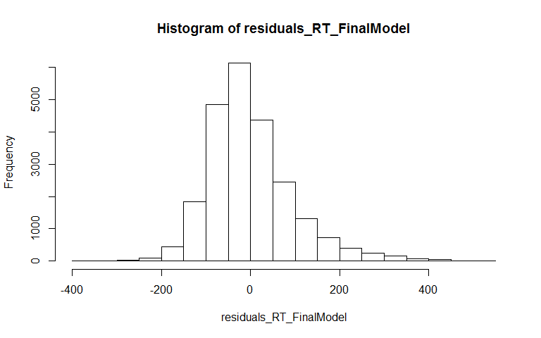
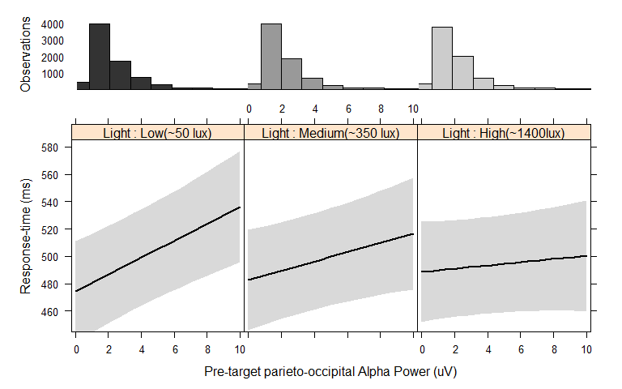

# Blue_Enriched_light_Markdown
Daniel Newman  
8 July 2015  

## This data is from an experiment conducted as part of Daniel P Newman's PhD at Monash University. The experiment was conceived in order to test whether ocular exposure to Blue Enriched light modulates behavioural and electrophysiological markers of spatial attention bias

**Background:** Alert healthy subjects typically exhibit a subtle bias of spatial attention favouring left space. This bias is attenuated, or shifted rightwards, under conditions of decreased alertness. This is consistent with theoretical models proposing that a right-hemisphere-lateralised ventral 'alertness' network regulates inter-hemispheric rivalry in the bilateral dorsal orienting network. Ocular exposure to short wavelength blue enriched white light (max ~480nm) can result in increased alertness and overt behavioural improvements during cognitive tasks.  Here we tested the hypothesis that prior exposure to higher, relative to lower, intensities of blue enriched white light would promote the direction of attention to left space, as measured by behavioural and electrophysiological indices.  

**Methods:** Healthy participants (N=24) were exposed to three blue enriched light intensities (low/medium/high- 50/350/1400lux, respectively) in a counterbalanced repeated-measures design over 72 separate sessions.  Sessions began 13.5 hours after waking and comprised 10 min dark adaptation, then 1 hour of light exposure followed by a ~36 min spatial attention task.   Behavioural and EEG indices of spatial attention were deriv. 


##Target detection accuracy was at ceiling (97.4%)


```r
summary(Accuracy_checker$Accuracy)
```

```
##    Min. 1st Qu.  Median    Mean 3rd Qu.    Max. 
##   78.12   97.25   98.81   97.43   99.70  100.00
```


############################################################################################################
############################################################################################################
############################################################################################################
############################################################################################################
############################################################################################################
############################################################################################################
############################################################################################################
############################################################################################################
############################################################################################################
############################################################################################################
############################################################################################################
############################################################################################################
############################################################################################################
############################################################################################################


##Higher light intensity speeds target detection, specifically to left-hemifield targets

###Crossed vs Nested Factors 

**There were 6 possible order combinations of the 3 light conditions that participants could be exposed to. Each participant was exposed to the light conditions in one of the 6 possible orders ("LightCondOrder"), in a counterbalanced manner. Because each Participant ("ID")" occurs within one and only one level of LightCondOrder we say that ID is nested within LightCondOrder:**

```r
#Show that ID is nested inside LightCondOrder:
with(data, isNested(ID,LightCondOrder))
```

```
## [1] TRUE
```

```r
# The following table show which level of LightCondOrder (either HML, HLM, MHL, MLH, LHM or LMH) each participant is nested inside. The numbers '986 etc.' represent the total single trial RTs each participant has remaining after misses and outliers are removed (each participant did 3 light sessions with 336 trials in each session)
xtabs(~ ID + LightCondOrder, data, drop = TRUE, sparse = TRUE)
```

```
## 24 x 6 sparse Matrix of class "dgCMatrix"
##      HML HLM MHL  MLH LHM LMH
## BL1    .   .   .    . 989   .
## BL10   .   .   .  994   .   .
## BL11   .   .   .    . 990   .
## BL12   .   .   .    .   . 903
## BL13 986   .   .    .   .   .
## BL14   . 975   .    .   .   .
## BL15   .   . 734    .   .   .
## BL16   .   .   .  961   .   .
## BL17   .   .   .    . 980   .
## BL18   .   .   .    .   . 995
## BL19 965   .   .    .   .   .
## BL2    .   .   .    .   . 996
## BL20   . 969   .    .   .   .
## BL21   .   .   .    .   . 976
## BL22   .   .   . 1002   .   .
## BL23   .   .   .    . 947   .
## BL24   .   . 961    .   .   .
## BL3  993   .   .    .   .   .
## BL4    . 991   .    .   .   .
## BL5    .   . 977    .   .   .
## BL6    .   .   .  972   .   .
## BL7  993   .   .    .   .   .
## BL8    . 983   .    .   .   .
## BL9    .   . 958    .   .   .
```

**The rest of the factors (ITI, MotionDirection, Hemifield, etc) are crossed or partially crossed factors, "crossed" means that they have an observation for each combination level each of the other factors (some factors might be partially crossed in some participants in the EEG analysis if there is a lot of data missing due to EEG artifacts etc).** 

##Now, we make a multilevel model to test the fixed effects of Light, Hemifield (i.e. target hemifield) and their interaction on Response-time (RT):

For Multilevel modeling with the lme4 package, nested factors are represended with random intercepts like this "...+(1 | LightCondOrder/ID).." - which means ID is nested inside LightCondOrder", while crossed and partially cross factors are represented with random intercepts like this ... +(1 |Light) +(1|ITI) +(1|MotionDirection) + (1|Hemifield)+ etc. Here I'm testing the fixed effects of Light and Hemifield and their interaction on RT, this is represented like this "....Light + Hemifield + Light:Hemifield"

Idealy I'll also add a by-subjects random slopes for each of the the fixed effect factors. By-subjects random slope reduce inflation of type 1 errors when using lmer() see Barr, Levy, Scheepers, & Tily, (2013). Random effects structure for confirmatory hypothesis testing: Keep it maximal. Journal of Memory and Language, 68(3), 255-278.So full by-subjects random slope for Light and Hemifield would be specified like this "...+(Light + Hemifield | LightCondOrder/ID)"

We have included Barr et al., (2013)'s recommendations into the current analysis. Even after following Barr et al.'s suggestions for dealing with non-convergence by removing outliers, and increasing the maximum number of iterations in the estimation procedure, the maximal did would not converge. Therefore we followed Barr et al.'s final strategy for coping with non-convergence by developing the random effects structure in a principled way and keeping those random effects that improved model fit and do not lead to convergence failures. It should be noted that more recent work on this topic (Bates, Kliegl, Vasishth, & Baayen, 2015; Matuschek, Kliegl, Vasishth, Baayen, & Bates, 2015) has highlighted the fact that Barr et al., (2013)'s "Keep it Maximal" recommendation is not always ideal, even in cases when  maximal models do converge. Matuschek et al., (2015) show that fitting the maximal random slope model can cause an overly conservative type I error rate  and therefore significantly decreases statistical power, even when the model converges and the data's generating process matches the maximal model, if variance components were not well supported by the data. These authors, which include researchers at the forefront of this field of statistics, explain that "the simulations on which Barr et al. (2013) base their recommendation are both too simple and too atypical for real data to support the claim that maximal random effects structure is desirable.........the maximal model in many analyses of data from Psychology and Linguistics experiments, is almost always shown by this analysis to be degenerate, ..the advice to "keep it maximal" often creates hopelessly over-specified random effects because the number of correlation parameters to estimate rises quickly with the dimension of the random-effects vectors." 
Indeed, Barr et al. (2013)'s own methods included simplifying the random effects structure to random intercepts only when the model failed to converge (see Barr et al. 2013; p 266).    Therefore, we identified a parsimonious random effect structure for our re-analysis using an iterative procedure which employed likelihood ratio tests to compare models without each particular random effect versus the model including the random effect, and retaining only the random effects which both improved the model fit and did not lead to non-convergence. This leads to the inclusion of a by-subjects random slope of Hemifield, and by-subjects random slope pre-target alpha power (when it is a predictor of RT), but no random slopes of Light. Random intercepts for the crossed factors are also included.


### Maximal linear mixed model  


```r
summary(m0 <-lmer(RT ~ 1 + Light + Hemifield + Hemifield:Light +
                                          (Light + Hemifield + Hemifield:Light | LightCondOrder/ID) + 
                                          (1|Light) +
                                          (1|ITI) +
                                          (1|MotionDirection) + 
                                          (1|Quadrant) + 
                                          (1|ValidTrialNum), 
                                 data = data, REML=FALSE, na.action = na.omit))
```

```
## Warning in commonArgs(par, fn, control, environment()): maxfun < 10 *
## length(par)^2 is not recommended.
```

```
## Linear mixed model fit by maximum likelihood  ['lmerMod']
## Formula: 
## RT ~ 1 + Light + Hemifield + Hemifield:Light + (Light + Hemifield +  
##     Hemifield:Light | LightCondOrder/ID) + (1 | Light) + (1 |  
##     ITI) + (1 | MotionDirection) + (1 | Quadrant) + (1 | ValidTrialNum)
##    Data: data
## 
##       AIC       BIC    logLik  deviance  df.resid 
##  276219.9  276654.7 -138056.0  276111.9     23136 
## 
## Scaled residuals: 
##     Min      1Q  Median      3Q     Max 
## -4.1552 -0.6354 -0.1474  0.4625  5.8897 
## 
## Random effects:
##  Groups            Name                       Variance Std.Dev. Corr 
##  ValidTrialNum     (Intercept)                   0.00   0.000        
##  ID:LightCondOrder (Intercept)                3450.62  58.742        
##                    LightMedium                 925.60  30.424   -0.56
##                    LightHigh                   626.42  25.028   -0.64
##                    HemifieldRight              340.20  18.444   -0.36
##                    LightMedium:HemifieldRight   22.17   4.709    0.91
##                    LightHigh:HemifieldRight     78.82   8.878    0.39
##  LightCondOrder    (Intercept)                 544.40  23.332        
##                    LightMedium                1826.52  42.738   -0.96
##                    LightHigh                   903.68  30.061   -0.82
##                    HemifieldRight               14.38   3.792    0.83
##                    LightMedium:HemifieldRight   11.46   3.385   -0.72
##                    LightHigh:HemifieldRight     71.95   8.483    0.06
##  Quadrant          (Intercept)                  17.59   4.194        
##  ITI               (Intercept)                 647.70  25.450        
##  Light             (Intercept)                   0.00   0.000        
##  MotionDirection   (Intercept)                  39.95   6.321        
##  Residual                                     8550.16  92.467        
##                         
##                         
##                         
##                         
##   0.86                  
##  -0.12 -0.06            
##  -0.74 -0.62 -0.28      
##   0.28  0.40 -0.73  0.37
##                         
##                         
##   0.68                  
##  -0.95 -0.43            
##   0.51  0.95 -0.23      
##  -0.30  0.49  0.58  0.64
##                         
##                         
##                         
##                         
##                         
## Number of obs: 23190, groups:  
## ValidTrialNum, 336; ID:LightCondOrder, 24; LightCondOrder, 6; Quadrant, 4; ITI, 3; Light, 3; MotionDirection, 2
## 
## Fixed effects:
##                            Estimate Std. Error t value
## (Intercept)                499.9464    21.9403  22.787
## LightMedium                 -0.9295    18.6393  -0.050
## LightHigh                   -8.2777    13.4579  -0.615
## HemifieldRight               3.5349     6.2094   0.569
## LightMedium:HemifieldRight   1.1574     3.4199   0.338
## LightHigh:HemifieldRight     7.6105     4.9079   1.551
## 
## Correlation of Fixed Effects:
##             (Intr) LghtMd LghtHg HmfldR LgM:HR
## LightMedium -0.496                            
## LightHigh   -0.467  0.702                     
## HemifldRght -0.110 -0.228 -0.086              
## LghtMdm:HmR  0.042  0.055  0.237 -0.277       
## LghtHgh:HmR  0.118 -0.190  0.302 -0.206  0.483
## convergence code: 0
## maxfun < 10 * length(par)^2 is not recommended.
```

```r
#Model failed to converge
# maxfun < 10 * length(par)^2 is not recommended.
# convergence code 1 from bobyqa: bobyqa -- maximum number of function evaluations exceeded
```

Warning messages " maxfun < 10 * length(par)^2 is not recommended" and 
"Model failed to converge with max|grad| = 0.00775512 (tol = 0.002, component 1)"
Means that the model is overparameterized and will not produce accurate parameter estimates


*According to Bates et al. (2015) One option to reduce the complexity of the maximal model is to force correlation parameters to zero. lets try that:*


```r
m0v2 <-lmer(RT ~ 1 + Light + Hemifield + Hemifield:Light +
                                          (Light + Hemifield + Hemifield:Light || LightCondOrder/ID) + 
                                          (1|Light) +
                                          (1|ITI) +
                                          (1|MotionDirection) + 
                                          (1|Quadrant) + 
                                          (1|ValidTrialNum), 
                                 data = data, REML=FALSE, na.action = na.omit)
```

```
## Warning in commonArgs(par, fn, control, environment()): maxfun < 10 *
## length(par)^2 is not recommended.
```

```
## Warning in optwrap(optimizer, devfun, getStart(start, rho$lower, rho$pp), :
## convergence code 1 from bobyqa: bobyqa -- maximum number of function
## evaluations exceeded
```

```
## Warning in commonArgs(par, fn, control, environment()): maxfun < 10 *
## length(par)^2 is not recommended.
```

```
## Warning in optwrap(optimizer, devfun, opt$par, lower = rho$lower, control
## = control, : convergence code 1 from bobyqa: bobyqa -- maximum number of
## function evaluations exceeded
```

```
## Warning in checkConv(attr(opt, "derivs"), opt$par, ctrl = control
## $checkConv, : Model failed to converge with max|grad| = 0.0687319 (tol =
## 0.002, component 1)
```

```r
#Model failed to converge
# maxfun < 10 * length(par)^2 is not recommended.
# convergence code 1 from bobyqa: bobyqa -- maximum number of function evaluations exceeded
# unable to evaluate scaled gradient
# Model failed to converge: degenerate  Hessian with 3 negative eigenvalues
```
Model still failed to converge: degenerate  Hessian with 1 negative eigenvalues
maxfun < 10 * length(par)^2 is not recommended.

**In order to try get the model to converge, try identified a random effect structure using the Trembley (2015)s forward-fitting procedure from LMERConvenienceFunctions package. This is an iterative model fitting procedure that retains the random effects that improve the model's fit and removes random effects that lead to failure to converge**

```r
# install.packages("LMERConvenienceFunctions")
require(LMERConvenienceFunctions)

# fit basic model, just the fixed effects and random intercepts of Participants nested inside LightCondOrder
m1 <- lmer(RT ~ 1 + Hemifield + Light + Hemifield:Light + 
                       (1|LightCondOrder/ID), 
           data = data, REML=FALSE, na.action = na.omit)


# Use " ffRanefLMER.fnc" to run forward fitting of the random effects terms
  ffRanefLMER.fnc(model = m1, ran.effects = c( "(1|Light)",
                                               "(1|ITI)",
                                               "(1|MotionDirection)", 
                                               "(1|Quadrant)",
                                               "(1|ValidTrialNum)",
                                               "(0+Hemifield | ID)", 
                                               "(0+Light | ID)"), log.file = FALSE)
```

```
## evaluating addition of (1|Light) to model
## 	log-likelihood ratio test p-value = 1 
## 	not adding (1|Light) to model
## evaluating addition of (1|ITI) to model
## 	log-likelihood ratio test p-value = 5.104264e-299 
## 	adding (1|ITI) to model
## evaluating addition of (1|MotionDirection) to model
## 	log-likelihood ratio test p-value = 7.711226e-12 
## 	adding (1|MotionDirection) to model
## evaluating addition of (1|Quadrant) to model
## 	log-likelihood ratio test p-value = 6.829544e-06 
## 	adding (1|Quadrant) to model
## evaluating addition of (1|ValidTrialNum) to model
## 	log-likelihood ratio test p-value = 0.9999721 
## 	not adding (1|ValidTrialNum) to model
## evaluating addition of (0+Hemifield|ID) to model
## 	log-likelihood ratio test p-value = 2.697017e-26 
## 	adding (0+Hemifield|ID) to model
## evaluating addition of (0+Light|ID) to model
```

```
## Warning in checkConv(attr(opt, "derivs"), opt$par, ctrl = control
## $checkConv, : unable to evaluate scaled gradient
```

```
## Warning in checkConv(attr(opt, "derivs"), opt$par, ctrl = control
## $checkConv, : Model failed to converge: degenerate Hessian with 1 negative
## eigenvalues
```

```
## 	log-likelihood ratio test p-value = 0 
## 	adding (0+Light|ID) to model
```

```
## Linear mixed model fit by maximum likelihood  ['lmerMod']
## Formula: RT ~ Hemifield + Light + (1 | LightCondOrder/ID) + (1 | ITI) +  
##     (1 | MotionDirection) + (1 | Quadrant) + (0 + Hemifield |  
##     ID) + (0 + Light | ID) + Hemifield:Light
##    Data: data
##       AIC       BIC    logLik  deviance  df.resid 
##  276211.0  276380.1 -138084.5  276169.0     23169 
## Random effects:
##  Groups            Name           Std.Dev.  Corr       
##  ID                LightLow       41.860586            
##                    LightMedium    16.120373 -0.53      
##                    LightHigh      23.534369  0.27 -0.81
##  ID.1              HemifieldLeft  40.669109            
##                    HemifieldRight 36.024956 0.91       
##  ID.LightCondOrder (Intercept)    27.899593            
##  LightCondOrder    (Intercept)     0.007785            
##  Quadrant          (Intercept)     4.232815            
##  ITI               (Intercept)    25.499637            
##  MotionDirection   (Intercept)     6.313267            
##  Residual                         92.513042            
## Number of obs: 23190, groups:  
## ID, 24; ID:LightCondOrder, 24; LightCondOrder, 6; Quadrant, 4; ITI, 3; MotionDirection, 2
## Fixed Effects:
##                (Intercept)              HemifieldRight  
##                   499.9269                      3.5813  
##                LightMedium                   LightHigh  
##                    -0.9176                     -8.2083  
## HemifieldRight:LightMedium    HemifieldRight:LightHigh  
##                     0.9463                      7.4736  
## convergence code 0; 2 optimizer warnings; 0 lme4 warnings
```

```r
#Final Model:
# RT ~ Light + Hemifield + Light:Hemifield + (1 | LightCondOrder/ID) + (1 | ITI) +  (1 | MotionDirection) + (1 | Quadrant) + (0 + Hemifield | ID):
summary(m2<-lmer(RT ~ 1 +  Light + Hemifield + Hemifield:Light + 
                              (1 | LightCondOrder/ID) + 
                              (1 | ITI) + 
                              (1 | MotionDirection) + 
                              (1 | Quadrant) + 
                              (0 + Hemifield | ID), 
                          data = data , REML=FALSE, na.action = na.omit))
```

```
## Linear mixed model fit by maximum likelihood  ['lmerMod']
## Formula: 
## RT ~ 1 + Light + Hemifield + Hemifield:Light + (1 | LightCondOrder/ID) +  
##     (1 | ITI) + (1 | MotionDirection) + (1 | Quadrant) + (0 +  
##     Hemifield | ID)
##    Data: data
## 
##       AIC       BIC    logLik  deviance  df.resid 
##  277744.2  277865.0 -138857.1  277714.2     23175 
## 
## Scaled residuals: 
##     Min      1Q  Median      3Q     Max 
## -4.0970 -0.6449 -0.1607  0.4641  5.7344 
## 
## Random effects:
##  Groups            Name           Variance Std.Dev. Corr
##  ID                HemifieldLeft  2228.52  47.207       
##                    HemifieldRight 1994.33  44.658   0.93
##  ID:LightCondOrder (Intercept)     261.35  16.166       
##  LightCondOrder    (Intercept)       0.00   0.000       
##  Quadrant          (Intercept)      17.08   4.132       
##  ITI               (Intercept)     649.69  25.489       
##  MotionDirection   (Intercept)      38.86   6.234       
##  Residual                         9217.23  96.006       
## Number of obs: 23190, groups:  
## ID, 24; ID:LightCondOrder, 24; LightCondOrder, 6; Quadrant, 4; ITI, 3; MotionDirection, 2
## 
## Fixed effects:
##                            Estimate Std. Error t value
## (Intercept)                 499.945     18.725  26.699
## LightMedium                  -1.557      2.184  -0.713
## LightHigh                    -8.352      2.177  -3.836
## HemifieldRight                3.453      5.815   0.594
## LightMedium:HemifieldRight    1.242      3.090   0.402
## LightHigh:HemifieldRight      7.512      3.082   2.437
## 
## Correlation of Fixed Effects:
##             (Intr) LghtMd LghtHg HmfldR LgM:HR
## LightMedium -0.058                            
## LightHigh   -0.058  0.497                     
## HemifldRght -0.200  0.186  0.187              
## LghtMdm:HmR  0.041 -0.707 -0.351 -0.263       
## LghtHgh:HmR  0.041 -0.351 -0.706 -0.264  0.497
```

```r
## Use Likelihood ratio test's to test each of the main effects and their interaction against the null hypothesis:
RT_no_fixed_effects<-lmer(RT ~ 1 + 
                              (1 | LightCondOrder/ID) + 
                              (1 | ITI) + 
                              (1 | MotionDirection) + 
                              (1 | Quadrant) + 
                              (0 + Hemifield | ID), 
                          data = data, REML=FALSE, na.action = na.omit)
RT_Hemifield<-update(RT_no_fixed_effects, .~. + Hemifield)
RT_Light<-update(RT_Hemifield, .~. + Light)
RT_HemifieldbyLight<-update(RT_Hemifield, .~. + Light:Hemifield)
anova(RT_no_fixed_effects,RT_Hemifield,RT_Light,RT_HemifieldbyLight)
```

```
## Data: data
## Models:
## RT_no_fixed_effects: RT ~ 1 + (1 | LightCondOrder/ID) + (1 | ITI) + (1 | MotionDirection) + 
## RT_no_fixed_effects:     (1 | Quadrant) + (0 + Hemifield | ID)
## RT_Hemifield: RT ~ (1 | LightCondOrder/ID) + (1 | ITI) + (1 | MotionDirection) + 
## RT_Hemifield:     (1 | Quadrant) + (0 + Hemifield | ID) + Hemifield
## RT_Light: RT ~ (1 | LightCondOrder/ID) + (1 | ITI) + (1 | MotionDirection) + 
## RT_Light:     (1 | Quadrant) + (0 + Hemifield | ID) + Hemifield + Light
## RT_HemifieldbyLight: RT ~ (1 | LightCondOrder/ID) + (1 | ITI) + (1 | MotionDirection) + 
## RT_HemifieldbyLight:     (1 | Quadrant) + (0 + Hemifield | ID) + Hemifield + Hemifield:Light
##                     Df    AIC    BIC  logLik deviance  Chisq Chi Df
## RT_no_fixed_effects 10 277752 277833 -138866   277732              
## RT_Hemifield        11 277753 277842 -138865   277731 1.2069      1
## RT_Light            13 277747 277852 -138860   277721 9.9510      2
## RT_HemifieldbyLight 15 277744 277865 -138857   277714 6.8102      2
##                     Pr(>Chisq)   
## RT_no_fixed_effects              
## RT_Hemifield          0.271953   
## RT_Light              0.006905 **
## RT_HemifieldbyLight   0.033203 * 
## ---
## Signif. codes:  0 '***' 0.001 '**' 0.01 '*' 0.05 '.' 0.1 ' ' 1
```

```r
## Or use Satterthwaite approximation to
# degrees of freedom through the lmerTest package
# (Kuznetsova, Krockhoff, & Rune, 2015).:
# summary(m3<-lmerTest::lmer(RT ~ 1 + Hemifield + Light +  Light:Hemifield + 
#                               (1 | LightCondOrder/ID) + 
#                               (1 | ITI) + 
#                               (1 | MotionDirection) + 
#                               (1 | Quadrant) + 
#                               (0 + Hemifield | ID), 
#                           data = data, REML=FALSE, na.action = na.omit))
```


**So a significant effect of Light and a significant Light x Hemifield interaction. Lets plot these effects:**


*So higher light intensities improved Response-times to left hemifield targets and not right hemifield targets. See simple effect stats below*

**Test the effect of Light inside left targets only:**

```
## 
## 	 Simultaneous Tests for General Linear Hypotheses
## 
## Multiple Comparisons of Means: Tukey Contrasts
## 
## 
## Fit: lmer(formula = RT ~ 1 + Light + (1 | LightCondOrder/ID) + (1 | 
##     ITI) + (1 | MotionDirection) + (1 | Quadrant), data = data[data$Hemifield == 
##     "Left", ], REML = FALSE, na.action = na.omit)
## 
## Linear Hypotheses:
##                    Estimate Std. Error z value Pr(>|z|)    
## Medium - Low == 0    -1.525      2.152  -0.709 0.758374    
## High - Low == 0      -8.352      2.144  -3.895 0.000281 ***
## High - Medium == 0   -6.827      2.154  -3.170 0.004281 ** 
## ---
## Signif. codes:  0 '***' 0.001 '**' 0.01 '*' 0.05 '.' 0.1 ' ' 1
## (Adjusted p values reported -- single-step method)
```

**Test the effect of Light inside Right targets only:**

```
## 
## 	 Simultaneous Tests for General Linear Hypotheses
## 
## Multiple Comparisons of Means: Tukey Contrasts
## 
## 
## Fit: lmer(formula = RT ~ 1 + Light + (1 | LightCondOrder/ID) + (1 | 
##     ITI) + (1 | MotionDirection) + (1 | Quadrant), data = data[data$Hemifield == 
##     "Right", ], REML = FALSE, na.action = na.omit)
## 
## Linear Hypotheses:
##                    Estimate Std. Error z value Pr(>|z|)
## Medium - Low == 0   -0.2935     2.2179  -0.132    0.990
## High - Low == 0     -0.8249     2.2130  -0.373    0.926
## High - Medium == 0  -0.5313     2.2228  -0.239    0.969
## (Adjusted p values reported -- single-step method)
```

**There is no  effect of light on right hemifield targets. So this is really cool, higher light intensities improved Response-times to left hemifield targets and not right hemifield targets** 


###Does VerticalVisualField (upper vs lower patch) influence the Light and Hemifield effects?

```
## Data: data
## Models:
## RT_HemifieldbyLight: RT ~ (1 | LightCondOrder/ID) + (1 | ITI) + (1 | MotionDirection) + 
## RT_HemifieldbyLight:     (1 | Quadrant) + (0 + Hemifield | ID) + Hemifield + Hemifield:Light
## RT_VerticalVisualField: RT ~ (1 | LightCondOrder/ID) + (1 | ITI) + (1 | MotionDirection) + 
## RT_VerticalVisualField:     (1 | Quadrant) + (0 + Hemifield | ID) + Hemifield + VerticalVisualField + 
## RT_VerticalVisualField:     Hemifield:Light
## RT_HemifieldbyVerticalVisualField: RT ~ (1 | LightCondOrder/ID) + (1 | ITI) + (1 | MotionDirection) + 
## RT_HemifieldbyVerticalVisualField:     (1 | Quadrant) + (0 + Hemifield | ID) + Hemifield + VerticalVisualField + 
## RT_HemifieldbyVerticalVisualField:     Hemifield:Light + Hemifield:VerticalVisualField
## RT_VerticalVisualFieldbyLight: RT ~ (1 | LightCondOrder/ID) + (1 | ITI) + (1 | MotionDirection) + 
## RT_VerticalVisualFieldbyLight:     (1 | Quadrant) + (0 + Hemifield | ID) + Hemifield + VerticalVisualField + 
## RT_VerticalVisualFieldbyLight:     Hemifield:Light + Hemifield:VerticalVisualField + VerticalVisualField:Light
## RT_HemifieldbyLightbyVerticalVisualField: RT ~ (1 | LightCondOrder/ID) + (1 | ITI) + (1 | MotionDirection) + 
## RT_HemifieldbyLightbyVerticalVisualField:     (1 | Quadrant) + (0 + Hemifield | ID) + Hemifield + VerticalVisualField + 
## RT_HemifieldbyLightbyVerticalVisualField:     Hemifield:Light + Hemifield:VerticalVisualField + VerticalVisualField:Light + 
## RT_HemifieldbyLightbyVerticalVisualField:     Hemifield:VerticalVisualField:Light
##                                          Df    AIC    BIC  logLik deviance
## RT_HemifieldbyLight                      15 277744 277865 -138857   277714
## RT_VerticalVisualField                   16 277739 277868 -138853   277707
## RT_HemifieldbyVerticalVisualField        17 277740 277877 -138853   277706
## RT_VerticalVisualFieldbyLight            19 277743 277896 -138852   277705
## RT_HemifieldbyLightbyVerticalVisualField 21 277747 277916 -138852   277705
##                                           Chisq Chi Df Pr(>Chisq)   
## RT_HemifieldbyLight                                                 
## RT_VerticalVisualField                   7.2756      1    0.00699 **
## RT_HemifieldbyVerticalVisualField        1.1093      1    0.29224   
## RT_VerticalVisualFieldbyLight            0.8225      2    0.66282   
## RT_HemifieldbyLightbyVerticalVisualField 0.3106      2    0.85615   
## ---
## Signif. codes:  0 '***' 0.001 '**' 0.01 '*' 0.05 '.' 0.1 ' ' 1
```

```
## Data: data
## Models:
## RS: RT ~ (1 | LightCondOrder/ID) + (1 | ITI) + (1 | MotionDirection) + 
## RS:     (1 | Quadrant) + (0 + Hemifield | ID) + Hemifield + (0 + 
## RS:     VerticalVisualField | ID) + Hemifield:Light
## VerticalVisualField: RT ~ (1 | LightCondOrder/ID) + (1 | ITI) + (1 | MotionDirection) + 
## VerticalVisualField:     (1 | Quadrant) + (0 + Hemifield | ID) + Hemifield + (0 + 
## VerticalVisualField:     VerticalVisualField | ID) + VerticalVisualField + Hemifield:Light
##                     Df    AIC    BIC  logLik deviance Chisq Chi Df
## RS                  18 277673 277817 -138818   277637             
## VerticalVisualField 19 277670 277823 -138816   277632 4.578      1
##                     Pr(>Chisq)  
## RS                              
## VerticalVisualField    0.03238 *
## ---
## Signif. codes:  0 '***' 0.001 '**' 0.01 '*' 0.05 '.' 0.1 ' ' 1
```
The lack of any significant Target Hemifield by Vertical Visual Field by Light interactions, indicates that that effect of Light on left hemifield RTs was consistent regardless of whether the target appeared in the upper or lower dot patch


###Does the effect of light on RT diminish over time-on-task (TOT)?

**First test if TOT moderates the effect of Light on Left-hemifield Targets only:**

```
## Data: data[data$Hemifield == "Left", ]
## Models:
## RT_Light_LeftTargets: RT ~ 1 + Light + (1 | LightCondOrder/ID) + (1 | ITI) + (1 | MotionDirection) + 
## RT_Light_LeftTargets:     (1 | Quadrant) + (1 | ValidTrialNum)
## RT_TOT_LeftTargets: RT ~ Light + (1 | LightCondOrder/ID) + (1 | ITI) + (1 | MotionDirection) + 
## RT_TOT_LeftTargets:     (1 | Quadrant) + (1 | ValidTrialNum) + ValidTrialNum
## RT_TOTbyLight_LeftTargets: RT ~ Light + (1 | LightCondOrder/ID) + (1 | ITI) + (1 | MotionDirection) + 
## RT_TOTbyLight_LeftTargets:     (1 | Quadrant) + (1 | ValidTrialNum) + ValidTrialNum + Light:ValidTrialNum
##                           Df    AIC    BIC logLik deviance  Chisq Chi Df
## RT_Light_LeftTargets      10 138762 138836 -69371   138742              
## RT_TOT_LeftTargets        11 138763 138844 -69371   138741 1.0598      1
## RT_TOTbyLight_LeftTargets 13 138765 138861 -69370   138739 1.8888      2
##                           Pr(>Chisq)
## RT_Light_LeftTargets                
## RT_TOT_LeftTargets            0.3033
## RT_TOTbyLight_LeftTargets     0.3889
```
So TOT does not moderate the effect of Light on Left-hemifield Targets indicating that the effect of prior Light exposure on left hemifield RTs persisted over the duration of our attention task. Since there was no significant fixed effects involving TOT when random slopes of TOT were not included, there would definetly be none if we tried to include random slopes of TOT. 

**Now test if time-on-task (TOT) moderates the Hemifield x Light interaction:**

```
## Data: data
## Models:
## RT_HemifieldbyLight: RT ~ (1 | LightCondOrder/ID) + (1 | ITI) + (1 | MotionDirection) + 
## RT_HemifieldbyLight:     (1 | Quadrant) + (0 + Hemifield | ID) + Hemifield + Hemifield:Light
## RT_TOT: RT ~ (1 | LightCondOrder/ID) + (1 | ITI) + (1 | MotionDirection) + 
## RT_TOT:     (1 | Quadrant) + (0 + Hemifield | ID) + Hemifield + ValidTrialNum + 
## RT_TOT:     Hemifield:Light
## RT_HemifieldbyTOT: RT ~ (1 | LightCondOrder/ID) + (1 | ITI) + (1 | MotionDirection) + 
## RT_HemifieldbyTOT:     (1 | Quadrant) + (0 + Hemifield | ID) + Hemifield + ValidTrialNum + 
## RT_HemifieldbyTOT:     Hemifield:Light + Hemifield:ValidTrialNum
## RT_LightbyTOT: RT ~ (1 | LightCondOrder/ID) + (1 | ITI) + (1 | MotionDirection) + 
## RT_LightbyTOT:     (1 | Quadrant) + (0 + Hemifield | ID) + Hemifield + ValidTrialNum + 
## RT_LightbyTOT:     Light + Hemifield:Light + Hemifield:ValidTrialNum + ValidTrialNum:Light
## RT_HemifieldbyLightbyTOT: RT ~ (1 | LightCondOrder/ID) + (1 | ITI) + (1 | MotionDirection) + 
## RT_HemifieldbyLightbyTOT:     (1 | Quadrant) + (0 + Hemifield | ID) + Hemifield + ValidTrialNum + 
## RT_HemifieldbyLightbyTOT:     Light + Hemifield:Light + Hemifield:ValidTrialNum + ValidTrialNum:Light + 
## RT_HemifieldbyLightbyTOT:     Hemifield:ValidTrialNum:Light
##                          Df    AIC    BIC  logLik deviance  Chisq Chi Df
## RT_HemifieldbyLight      15 277744 277865 -138857   277714              
## RT_TOT                   16 277744 277872 -138856   277712 2.6133      1
## RT_HemifieldbyTOT        17 277736 277873 -138851   277702 9.4079      1
## RT_LightbyTOT            19 277740 277893 -138851   277702 0.3354      2
## RT_HemifieldbyLightbyTOT 21 277741 277910 -138849   277699 2.8897      2
##                          Pr(>Chisq)   
## RT_HemifieldbyLight                   
## RT_TOT                     0.105971   
## RT_HemifieldbyTOT          0.002161 **
## RT_LightbyTOT              0.845598   
## RT_HemifieldbyLightbyTOT   0.235785   
## ---
## Signif. codes:  0 '***' 0.001 '**' 0.01 '*' 0.05 '.' 0.1 ' ' 1
```

```
## Linear mixed model fit by maximum likelihood  ['lmerMod']
## Formula: RT ~ 1 + Light + Hemifield + Hemifield:Light + ValidTrialNum +  
##     Hemifield:ValidTrialNum + (1 | LightCondOrder/ID) + (1 |  
##     ITI) + (1 | MotionDirection) + (1 | Quadrant) + (0 + Hemifield |  
##     ID) + (0 + ValidTrialNum | ID)
##    Data: data
## 
##       AIC       BIC    logLik  deviance  df.resid 
##  277697.3  277842.3 -138830.7  277661.3     23172 
## 
## Scaled residuals: 
##     Min      1Q  Median      3Q     Max 
## -4.1570 -0.6450 -0.1556  0.4639  5.8360 
## 
## Random effects:
##  Groups            Name           Variance  Std.Dev. Corr
##  ID                ValidTrialNum  4.750e-03  0.06892     
##  ID.1              HemifieldLeft  3.614e+02 19.00995     
##                    HemifieldRight 2.054e+02 14.33177 0.50
##  ID.LightCondOrder (Intercept)    1.596e+03 39.94513     
##  LightCondOrder    (Intercept)    7.825e+03 88.46121     
##  Quadrant          (Intercept)    3.825e+03 61.84959     
##  ITI               (Intercept)    4.125e+03 64.22511     
##  MotionDirection   (Intercept)    4.905e+03 70.03355     
##  Residual                         9.165e+03 95.73403     
## Number of obs: 23190, groups:  
## ID, 24; ID:LightCondOrder, 24; LightCondOrder, 6; Quadrant, 4; ITI, 3; MotionDirection, 2
## 
## Fixed effects:
##                                Estimate Std. Error t value
## (Intercept)                  498.561103  84.442127   5.904
## LightMedium                   -1.504722   2.179249  -0.690
## LightHigh                     -8.364086   2.171418  -3.852
## HemifieldRight                10.155283  62.025239   0.164
## ValidTrialNum                  0.008515   0.016804   0.507
## LightMedium:HemifieldRight     1.326304   3.081985   0.430
## LightHigh:HemifieldRight       7.571360   3.073145   2.464
## HemifieldRight:ValidTrialNum  -0.040027   0.012989  -3.082
## 
## Correlation of Fixed Effects:
##             (Intr) LghtMd LghtHg HmfldR VldTrN LgM:HR LgH:HR
## LightMedium -0.013                                          
## LightHigh   -0.013  0.498                                   
## HemifldRght -0.368  0.017  0.017                            
## ValidTrilNm -0.010 -0.007 -0.004  0.014                     
## LghtMdm:HmR  0.009 -0.707 -0.351 -0.024  0.004              
## LghtHgh:HmR  0.009 -0.351 -0.706 -0.024  0.003  0.497       
## HmfldRg:VTN  0.013  0.008  0.005 -0.035 -0.386 -0.013 -0.009
## convergence code: 1
## unable to evaluate scaled gradient
## Model failed to converge: degenerate  Hessian with 5 negative eigenvalues
```

```
## Linear mixed model fit by maximum likelihood t-tests use Satterthwaite
##   approximations to degrees of freedom [lmerMod]
## Formula: RT ~ 1 + Light + Hemifield + Hemifield:Light + ValidTrialNum +  
##     Hemifield:ValidTrialNum + (1 | LightCondOrder/ID) + (1 |  
##     ITI) + (1 | MotionDirection) + (1 | Quadrant) + (0 + Hemifield |  
##     ID)
##    Data: data
## 
##       AIC       BIC    logLik  deviance  df.resid 
##  277736.2  277873.0 -138851.1  277702.2     23173 
## 
## Scaled residuals: 
##     Min      1Q  Median      3Q     Max 
## -4.0888 -0.6460 -0.1601  0.4637  5.7211 
## 
## Random effects:
##  Groups            Name           Variance  Std.Dev.  Corr
##  ID                HemifieldLeft  2.758e+02 1.661e+01     
##                    HemifieldRight 3.972e+01 6.302e+00 0.13
##  ID:LightCondOrder (Intercept)    2.214e+03 4.705e+01     
##  LightCondOrder    (Intercept)    3.462e-08 1.861e-04     
##  Quadrant          (Intercept)    1.708e+01 4.133e+00     
##  ITI               (Intercept)    6.499e+02 2.549e+01     
##  MotionDirection   (Intercept)    3.899e+01 6.244e+00     
##  Residual                         9.212e+03 9.598e+01     
## Number of obs: 23190, groups:  
## ID, 24; ID:LightCondOrder, 24; LightCondOrder, 6; Quadrant, 4; ITI, 3; MotionDirection, 2
## 
## Fixed effects:
##                                Estimate Std. Error         df t value
## (Intercept)                   4.984e+02  1.879e+01  7.000e+00  26.521
## LightMedium                  -1.582e+00  2.184e+00  2.311e+04  -0.724
## LightHigh                    -8.368e+00  2.176e+00  2.311e+04  -3.845
## HemifieldRight                1.012e+01  6.208e+00  1.100e+01   1.631
## ValidTrialNum                 9.425e-03  9.204e-03  2.312e+04   1.024
## LightMedium:HemifieldRight    1.372e+00  3.090e+00  2.311e+04   0.444
## LightHigh:HemifieldRight      7.599e+00  3.081e+00  2.311e+04   2.466
## HemifieldRight:ValidTrialNum -3.995e-02  1.302e-02  2.312e+04  -3.068
##                              Pr(>|t|)    
## (Intercept)                  2.15e-08 ***
## LightMedium                  0.468895    
## LightHigh                    0.000121 ***
## HemifieldRight               0.130478    
## ValidTrialNum                0.305823    
## LightMedium:HemifieldRight   0.657018    
## LightHigh:HemifieldRight     0.013658 *  
## HemifieldRight:ValidTrialNum 0.002161 ** 
## ---
## Signif. codes:  0 '***' 0.001 '**' 0.01 '*' 0.05 '.' 0.1 ' ' 1
## 
## Correlation of Fixed Effects:
##             (Intr) LghtMd LghtHg HmfldR VldTrN LgM:HR LgH:HR
## LightMedium -0.057                                          
## LightHigh   -0.057  0.497                                   
## HemifldRght -0.207  0.171  0.173                            
## ValidTrilNm -0.082 -0.011 -0.007  0.248                     
## LghtMdm:HmR  0.040 -0.707 -0.351 -0.242  0.008              
## LghtHgh:HmR  0.040 -0.351 -0.706 -0.244  0.005  0.497       
## HmfldRg:VTN  0.058  0.008  0.005 -0.350 -0.707 -0.013 -0.009
```

And there is no Light x Target Hemifield x Time-on-task interaction on RT, again indicating that the effect of prior Light exposure on left hemifield RTs persisted over the duration of our attention task.

There is a significant Hemifield x TOT interaction, reflecting an effect whereby responses are faster to left than right hemifield targets during the first half of the ~40min session, but this left-hemifield advantage disappears during the second half of the session. This is consistent witht the rightward shift in spatial attention bias over time-on-task reported in many previous studies (e.g. Newman et al 2013). This effect is probably not very relevant for the current study since the effect is not moderated by Light. So will not bother breaking this interaction down and will probably not bother reporting in the paper. Could put it in the supplementary section maybe if we want, if so here is the interactions broken down into simple effects, and also a plot of the interaction:  

```
## 
## 	 Simultaneous Tests for General Linear Hypotheses
## 
## Fit: lmer(formula = RT ~ 1 + ValidTrialNum + (1 | LightCondOrder/ID) + 
##     (1 | ITI) + (1 | MotionDirection) + (1 | Quadrant), data = data[data$Hemifield == 
##     "Left", ], REML = FALSE, na.action = na.omit)
## 
## Linear Hypotheses:
##                     Estimate Std. Error z value Pr(>|z|)    
## (Intercept) == 0   4.951e+02  1.864e+01  26.556   <1e-10 ***
## ValidTrialNum == 0 9.191e-03  9.075e-03   1.013    0.525    
## ---
## Signif. codes:  0 '***' 0.001 '**' 0.01 '*' 0.05 '.' 0.1 ' ' 1
## (Adjusted p values reported -- single-step method)
```

```
## 
## 	 Simultaneous Tests for General Linear Hypotheses
## 
## Fit: lmer(formula = RT ~ 1 + ValidTrialNum + (1 | LightCondOrder/ID) + 
##     (1 | ITI) + (1 | MotionDirection) + (1 | Quadrant), data = data[data$Hemifield == 
##     "Right", ], REML = FALSE, na.action = na.omit)
## 
## Linear Hypotheses:
##                      Estimate Std. Error z value Pr(>|z|)    
## (Intercept) == 0   508.201994  18.936243  26.838  < 1e-10 ***
## ValidTrialNum == 0  -0.030680   0.009344  -3.283  0.00205 ** 
## ---
## Signif. codes:  0 '***' 0.001 '**' 0.01 '*' 0.05 '.' 0.1 ' ' 1
## (Adjusted p values reported -- single-step method)
```


**Check assumptions for RT model by plotting residuals:**



**Above looks OK, distribution is a little skewed, but not too bad**


##Show that the Hemifield*Light interaction for RT data holds up when using the old/"classical" ANOVA, to satisify Reviewer #1's request

```
## $ANOVA
##            Effect DFn DFd         F          p p<.05         ges
## 2           Light   2  46 0.1285124 0.87971723       0.001239508
## 3       Hemifield   1  23 2.9112522 0.10143262       0.003347501
## 4 Light:Hemifield   2  46 3.0707765 0.05600142       0.000937493
## 
## $`Mauchly's Test for Sphericity`
##            Effect         W         p p<.05
## 2           Light 0.8585236 0.1867561      
## 4 Light:Hemifield 0.9501537 0.5698132      
## 
## $`Sphericity Corrections`
##            Effect       GGe      p[GG] p[GG]<.05       HFe      p[HF]
## 2           Light 0.8760584 0.85381572           0.9424658 0.86840990
## 4 Light:Hemifield 0.9525204 0.05882834           1.0362897 0.05600142
##   p[HF]<.05
## 2          
## 4
```

##Get means and standard errors for the effect of Light on RTs to satisfy Reviewer #1's request

```
##    Light Hemifield    N       RT  RT_norm       sd       se       ci
## 1   High      Left 3882 490.3807 490.5125 102.8931 1.651423 3.237739
## 2   High     Right 3858 501.6962 501.5727 109.6261 1.764952 3.460327
## 3    Low      Left 3899 499.0654 498.7991 110.0881 1.763047 3.456582
## 4    Low     Right 3892 502.5827 502.2904 112.4038 1.801749 3.532463
## 5 Medium      Left 3831 496.6912 496.9779 108.9079 1.759557 3.449758
## 6 Medium     Right 3828 501.5773 501.8497 109.2102 1.765132 3.460690
```
So using the classic ANOVA style analysis the Light:Hemifield interaction is not quite significant, p=0.056. The classic ANOVA has less power then the multilevel modeling approach because it can not describe the participants as being nested inside LightCondOrder as the multilevel modeling approach can.

############################################################################################################
############################################################################################################
############################################################################################################
############################################################################################################
############################################################################################################
############################################################################################################
############################################################################################################
############################################################################################################
############################################################################################################
############################################################################################################
############################################################################################################
############################################################################################################
############################################################################################################
############################################################################################################

##Light intensity specifically modulates alpha-power over right-hemisphere regions that are sensitive to spatial attention orienting

###First pre-target Alpha Power pooled from all Parieto-Occipital electrodes

**The effect of Light on Pre-target Alpha power:**


```
## Number of Observations for model:
```

```
## [1] 22513
```

```
## evaluating addition of (1|Light) to model
## 	log-likelihood ratio test p-value = 1 
## 	not adding (1|Light) to model
## evaluating addition of (1|ITI) to model
## 	log-likelihood ratio test p-value = 3.280542e-09 
## 	adding (1|ITI) to model
## evaluating addition of (1|ValidTrialNum) to model
## 	log-likelihood ratio test p-value = 4.114305e-22 
## 	adding (1|ValidTrialNum) to model
## evaluating addition of (0+Light|ID) to model
```

```
## Warning in checkConv(attr(opt, "derivs"), opt$par, ctrl = control$checkConv, : Model is nearly unidentifiable: large eigenvalue ratio
##  - Rescale variables?
```

```
## 	log-likelihood ratio test p-value = 4.553486e-171 
## 	adding (0+Light|ID) to model
```

```
## Linear mixed model fit by maximum likelihood  ['lmerMod']
## Formula: 
## log(PreAlphaPower_all_PO_chans) ~ Light + (1 | LightCondOrder/ID) +  
##     (1 | ITI) + (1 | ValidTrialNum) + (0 + Light | ID)
##    Data: data2
##       AIC       BIC    logLik  deviance  df.resid 
## 16811.741 16924.047 -8391.871 16783.741     22499 
## Random effects:
##  Groups            Name        Std.Dev. Corr     
##  ValidTrialNum     (Intercept) 0.043420          
##  ID                LightLow    0.234021          
##                    LightMedium 0.231725 0.87     
##                    LightHigh   0.233380 0.79 0.91
##  ID:LightCondOrder (Intercept) 0.431187          
##  LightCondOrder    (Intercept) 0.000147          
##  ITI               (Intercept) 0.019106          
##  Residual                      0.346885          
## Number of obs: 22513, groups:  
## ValidTrialNum, 336; ID, 24; ID:LightCondOrder, 24; LightCondOrder, 6; ITI, 3
## Fixed Effects:
## (Intercept)  LightMedium    LightHigh  
##     0.53263      0.01722      0.03876  
## convergence code 0; 1 optimizer warnings; 0 lme4 warnings
```

```
## Data: data2
## Models:
## PreAlphaPower_all_PO_chans_no_fixed_effects: log(PreAlphaPower_all_PO_chans) ~ 1 + (1 | LightCondOrder/ID) + 
## PreAlphaPower_all_PO_chans_no_fixed_effects:     (1 | Light) + (1 | ITI) + (1 | ValidTrialNum)
## PreAlphaPower_all_PO_chans_Light: log(PreAlphaPower_all_PO_chans) ~ (1 | LightCondOrder/ID) + (1 | 
## PreAlphaPower_all_PO_chans_Light:     Light) + (1 | ITI) + (1 | ValidTrialNum) + Light
##                                             Df   AIC   BIC  logLik
## PreAlphaPower_all_PO_chans_no_fixed_effects  7 17613 17669 -8799.4
## PreAlphaPower_all_PO_chans_Light             9 17609 17681 -8795.4
##                                             deviance Chisq Chi Df
## PreAlphaPower_all_PO_chans_no_fixed_effects    17599             
## PreAlphaPower_all_PO_chans_Light               17591 7.964      2
##                                             Pr(>Chisq)  
## PreAlphaPower_all_PO_chans_no_fixed_effects             
## PreAlphaPower_all_PO_chans_Light               0.01865 *
## ---
## Signif. codes:  0 '***' 0.001 '**' 0.01 '*' 0.05 '.' 0.1 ' ' 1
```

```
## Linear mixed model fit by maximum likelihood  ['lmerMod']
## Formula: log(PreAlphaPower_all_PO_chans) ~ (1 | LightCondOrder/ID) + (1 |  
##     Light) + (1 | ITI) + (1 | ValidTrialNum) + Light
##    Data: data2
## 
##      AIC      BIC   logLik deviance df.resid 
##  17608.8  17681.0  -8795.4  17590.8    22504 
## 
## Scaled residuals: 
##     Min      1Q  Median      3Q     Max 
## -6.7534 -0.6410 -0.0333  0.5926  4.5669 
## 
## Random effects:
##  Groups            Name        Variance  Std.Dev. 
##  ValidTrialNum     (Intercept) 1.809e-03 4.253e-02
##  ID:LightCondOrder (Intercept) 2.350e-01 4.848e-01
##  LightCondOrder    (Intercept) 6.002e-11 7.747e-06
##  ITI               (Intercept) 3.582e-04 1.893e-02
##  Light             (Intercept) 0.000e+00 0.000e+00
##  Residual                      1.256e-01 3.544e-01
## Number of obs: 22513, groups:  
## ValidTrialNum, 336; ID:LightCondOrder, 24; LightCondOrder, 6; ITI, 3; Light, 3
## 
## Fixed effects:
##             Estimate Std. Error t value
## (Intercept) 0.534624   0.099674   5.364
## LightMedium 0.013590   0.005785   2.349
## LightHigh   0.035912   0.005784   6.209
## 
## Correlation of Fixed Effects:
##             (Intr) LghtMd
## LightMedium -0.029       
## LightHigh   -0.029  0.498
```

```
## 
## 	 Simultaneous Tests for General Linear Hypotheses
## 
## Fit: lmer(formula = log(PreAlphaPower_all_PO_chans) ~ (1 | LightCondOrder/ID) + 
##     (1 | Light) + (1 | ITI) + (1 | ValidTrialNum) + Light, data = data2, 
##     REML = F, na.action = na.omit)
## 
## Linear Hypotheses:
##                                                           Estimate
## LightLow:PreAlphaPower vs LightMedium:PreAlphaPower == 0  0.013590
## LightLow:PreAlphaPower vs LightHigh:PreAlphaPower == 0    0.035912
## LightMedium:PreAlphaPower vs LightHigh:PreAlphaPower == 0 0.022322
##                                                           Std. Error
## LightLow:PreAlphaPower vs LightMedium:PreAlphaPower == 0    0.005785
## LightLow:PreAlphaPower vs LightHigh:PreAlphaPower == 0      0.005784
## LightMedium:PreAlphaPower vs LightHigh:PreAlphaPower == 0   0.005796
##                                                           z value Pr(>|z|)
## LightLow:PreAlphaPower vs LightMedium:PreAlphaPower == 0    2.349   0.0493
## LightLow:PreAlphaPower vs LightHigh:PreAlphaPower == 0      6.209   <0.001
## LightMedium:PreAlphaPower vs LightHigh:PreAlphaPower == 0   3.851   <0.001
##                                                              
## LightLow:PreAlphaPower vs LightMedium:PreAlphaPower == 0  *  
## LightLow:PreAlphaPower vs LightHigh:PreAlphaPower == 0    ***
## LightMedium:PreAlphaPower vs LightHigh:PreAlphaPower == 0 ***
## ---
## Signif. codes:  0 '***' 0.001 '**' 0.01 '*' 0.05 '.' 0.1 ' ' 1
## (Adjusted p values reported -- single-step method)
```

#################################################################################################


###Now test the effect of Light on Pre-target Alpha power, split by hemisphere, with each hemisphere ROI based on Spatial orienting:
    

```
## Number of Observations for model:
```

```
## [1] 45051
```

```
## evaluating addition of (1|Light) to model
## 	log-likelihood ratio test p-value = 1 
## 	not adding (1|Light) to model
## evaluating addition of (1|ITI) to model
## 	log-likelihood ratio test p-value = 7.62217e-13 
## 	adding (1|ITI) to model
## evaluating addition of (1|ValidTrialNum) to model
## 	log-likelihood ratio test p-value = 1.66551e-59 
## 	adding (1|ValidTrialNum) to model
## evaluating addition of (0+Hemisphere|ID) to model
```

```
## Warning in checkConv(attr(opt, "derivs"), opt$par, ctrl = control
## $checkConv, : unable to evaluate scaled gradient
```

```
## Warning in checkConv(attr(opt, "derivs"), opt$par, ctrl = control
## $checkConv, : Model failed to converge: degenerate Hessian with 1 negative
## eigenvalues
```

```
## 	log-likelihood ratio test p-value = 0.9385728 
## 	not adding (0+Hemisphere|ID) to model
## evaluating addition of (0+Light|ID) to model
```

```
## Warning in checkConv(attr(opt, "derivs"), opt$par, ctrl = control
## $checkConv, : Model failed to converge with max|grad| = 0.00516316 (tol =
## 0.002, component 1)
```

```
## 	log-likelihood ratio test p-value = 1.584652e-277 
## 	adding (0+Light|ID) to model
## evaluating addition of (0+Hemisphere*Light|ID) to model
```

```
## Warning in commonArgs(par, fn, control, environment()): maxfun < 10 *
## length(par)^2 is not recommended.
```

```
## Warning in optwrap(optimizer, devfun, getStart(start, rho$lower, rho$pp), :
## convergence code 1 from bobyqa: bobyqa -- maximum number of function
## evaluations exceeded
```

```
## Warning in checkConv(attr(opt, "derivs"), opt$par, ctrl = control
## $checkConv, : unable to evaluate scaled gradient
```

```
## Warning in checkConv(attr(opt, "derivs"), opt$par, ctrl = control
## $checkConv, : Model failed to converge: degenerate Hessian with 7 negative
## eigenvalues
```

```
## 	log-likelihood ratio test p-value = 1.57361e-47 
## 	adding (0+Hemisphere*Light|ID) to model
```

```
## Linear mixed model fit by maximum likelihood  ['lmerMod']
## Formula: 
## log(PreAlphaPower) ~ Light + Hemisphere + (1 | LightCondOrder/ID/Hemisphere) +  
##     (1 | ITI) + (1 | ValidTrialNum) + (0 + Light | ID) + (0 +  
##     Hemisphere * Light | ID) + Light:Hemisphere
##    Data: DF
##       AIC       BIC    logLik  deviance  df.resid 
##  47441.42  47781.33 -23681.71  47363.42     45012 
## Random effects:
##  Groups                         Name                        Std.Dev. Corr 
##  ValidTrialNum                  (Intercept)                 0.04907       
##  Hemisphere..ID.LightCondOrder. (Intercept)                 0.09207       
##  ID                             HemisphereLeft              0.27996       
##                                 HemisphereRight             0.21398   0.94
##                                 LightMedium                 0.07625  -0.89
##                                 LightHigh                   0.14288  -0.46
##                                 HemisphereRight:LightMedium 0.12618   0.29
##                                 HemisphereRight:LightHigh   0.13016   0.35
##  ID.1                           LightLow                    0.13685       
##                                 LightMedium                 0.14293  0.77 
##                                 LightHigh                   0.11814  0.58 
##  ID.LightCondOrder              (Intercept)                 0.39407       
##  LightCondOrder                 (Intercept)                 0.09602       
##  ITI                            (Intercept)                 0.01889       
##  Residual                                                   0.40519       
##                         
##                         
##                         
##                         
##                         
##  -0.79                  
##  -0.26  0.27            
##   0.03 -0.61 -0.04      
##   0.05 -0.28 -0.71  0.47
##                         
##                         
##  0.97                   
##                         
##                         
##                         
##                         
## Number of obs: 45051, groups:  
## ValidTrialNum, 336; Hemisphere:(ID:LightCondOrder), 48; ID, 24; ID:LightCondOrder, 24; LightCondOrder, 6; ITI, 3
## Fixed Effects:
##                 (Intercept)                  LightMedium  
##                     0.52896                      0.01337  
##                   LightHigh              HemisphereRight  
##                     0.03164                     -0.01950  
## LightMedium:HemisphereRight    LightHigh:HemisphereRight  
##                     0.03184                      0.03671  
## convergence code 1; 2 optimizer warnings; 1 lme4 warnings
```

```
## Data: DF
## Models:
## PreAlphaPower_no_fixed_effects: log(PreAlphaPower) ~ 1 + (1 | LightCondOrder/ID/Hemisphere) + 
## PreAlphaPower_no_fixed_effects:     (1 | Light) + (1 | ITI) + (1 | ValidTrialNum)
## PreAlphaPower_Light: log(PreAlphaPower) ~ (1 | LightCondOrder/ID/Hemisphere) + (1 | 
## PreAlphaPower_Light:     Light) + (1 | ITI) + (1 | ValidTrialNum) + Light
## PreAlphaPower_Hemisphere: log(PreAlphaPower) ~ (1 | LightCondOrder/ID/Hemisphere) + (1 | 
## PreAlphaPower_Hemisphere:     Light) + (1 | ITI) + (1 | ValidTrialNum) + Light + Hemisphere
## PreAlphaPower_LightbyHemisphere: log(PreAlphaPower) ~ (1 | LightCondOrder/ID/Hemisphere) + (1 | 
## PreAlphaPower_LightbyHemisphere:     Light) + (1 | ITI) + (1 | ValidTrialNum) + Light + Hemisphere + 
## PreAlphaPower_LightbyHemisphere:     Light:Hemisphere
##                                 Df   AIC   BIC logLik deviance   Chisq
## PreAlphaPower_no_fixed_effects   8 48987 49057 -24486    48971        
## PreAlphaPower_Light             10 48981 49069 -24481    48961  9.7882
## PreAlphaPower_Hemisphere        11 48983 49079 -24481    48961  0.0186
## PreAlphaPower_LightbyHemisphere 13 48970 49084 -24472    48944 16.9982
##                                 Chi Df Pr(>Chisq)    
## PreAlphaPower_no_fixed_effects                       
## PreAlphaPower_Light                  2  0.0074907 ** 
## PreAlphaPower_Hemisphere             1  0.8914615    
## PreAlphaPower_LightbyHemisphere      2  0.0002037 ***
## ---
## Signif. codes:  0 '***' 0.001 '**' 0.01 '*' 0.05 '.' 0.1 ' ' 1
```

**So we have a significant main effect of Light and a Light x Hemisphere interaction on pre-target alpha power**

**So, according to the multilevel model there is a signficant Light by Hemisphere interaction, lets plot it:**


**Put the plot above and RT_BarGraph into the one multi panel plot:**

```
## NULL
```

```
## NULL
```

```
## NULL
```


```
## NULL
```

```
## NULL
```

```
## NULL
```

```
## png 
##   2
```


**Plot above suggests Light has a larger effect on Right hemisphere than on Left hemisphere. so, next we'll run simple effects of light seperatly inside each hemisphere:**

**Effect of Light on Left Hemisphere vs. on Right Hemisphere:**

```
## 
## 	 Simultaneous Tests for General Linear Hypotheses
## 
## Multiple Comparisons of Means: Tukey Contrasts
## 
## 
## Fit: lmer(formula = log(PreAlphaPower) ~ Light + (1 | LightCondOrder/ID) + 
##     (1 | Light) + (1 | ITI) + (1 | ValidTrialNum), data = DF[DF$Hemisphere == 
##     "Left", ], REML = FALSE, na.action = na.omit)
## 
## Linear Hypotheses:
##                    Estimate Std. Error z value Pr(>|z|)    
## Medium - Low == 0  0.011040   0.006646   1.661    0.220    
## High - Low == 0    0.028785   0.006644   4.333   <0.001 ***
## High - Medium == 0 0.017745   0.006659   2.665    0.021 *  
## ---
## Signif. codes:  0 '***' 0.001 '**' 0.01 '*' 0.05 '.' 0.1 ' ' 1
## (Adjusted p values reported -- single-step method)
```

```
## 
## 	 Simultaneous Tests for General Linear Hypotheses
## 
## Multiple Comparisons of Means: Tukey Contrasts
## 
## 
## Fit: lmer(formula = log(PreAlphaPower) ~ Light + (1 | LightCondOrder/ID) + 
##     (1 | Light) + (1 | ITI) + (1 | ValidTrialNum), data = DF[DF$Hemisphere == 
##     "Right", ], REML = FALSE, na.action = na.omit)
## 
## Linear Hypotheses:
##                    Estimate Std. Error z value Pr(>|z|)    
## Medium - Low == 0  0.041052   0.006876   5.970  < 1e-04 ***
## High - Low == 0    0.065623   0.006875   9.545  < 1e-04 ***
## High - Medium == 0 0.024572   0.006890   3.566  0.00103 ** 
## ---
## Signif. codes:  0 '***' 0.001 '**' 0.01 '*' 0.05 '.' 0.1 ' ' 1
## (Adjusted p values reported -- single-step method)
```


**SWEET! So the effect of Light on the right-hemisphere scaled significantly in a step-wise fashion [high versus low, b= 0.07, SE=0.007, t= 9.55, p<0.0001; high versus medium, b= 0.03, SE=0.007, t=3.57, p=0.001; medium vs low, b= 0.04, SE=0.007, t= 5.97, p<0.0001]. In contrast, there was no difference between medium and low Light on left-hemisphere [b= 0.01, SE=0.007, t= 1.66, p=0.220], while the other two contrasts were significant but of smaller effect size [high versus low, b= 0.03, SE=0.007, t= 4.33, p<0.001; high versus medium, b= 0.02, SE=0.007, t=2.66, p=0.021]. And importantly, the electrodes chosen for analysis from left and right hemisphere where chosen based on their desynchronisation when orienting to left vs right targets (electrode choice was not based on the effect of Light)**


**Test if the Hemifield*Light interaction for RT data holds up when using the old/"classical" ANOVA, to satisify Reviewer #1's request**

```
## $ANOVA
##             Effect DFn DFd          F         p p<.05          ges
## 2            Light   2  46 1.73682073 0.1874265       2.251214e-03
## 3       Hemisphere   1  23 0.01169334 0.9148258       1.365945e-05
## 4 Light:Hemisphere   2  46 0.98651390 0.3806240       3.578660e-04
## 
## $`Mauchly's Test for Sphericity`
##             Effect         W          p p<.05
## 2            Light 0.7296380 0.03120196     *
## 4 Light:Hemisphere 0.9980589 0.97885341      
## 
## $`Sphericity Corrections`
##             Effect       GGe     p[GG] p[GG]<.05       HFe     p[HF]
## 2            Light 0.7871772 0.1949933           0.8350858 0.1934241
## 4 Light:Hemisphere 0.9980626 0.3805012           1.0928223 0.3806240
##   p[HF]<.05
## 2          
## 4
```

```
## $ANOVA
##   Effect DFn DFd         F         p p<.05          ges
## 2  Light   2  46 0.4710726 0.6273107       0.0008800696
## 
## $`Mauchly's Test for Sphericity`
##   Effect        W          p p<.05
## 2  Light 0.801665 0.08788646      
## 
## $`Sphericity Corrections`
##   Effect       GGe     p[GG] p[GG]<.05       HFe     p[HF] p[HF]<.05
## 2  Light 0.8344912 0.5934745           0.8920244 0.6059192
```

```
## $ANOVA
##   Effect DFn DFd        F          p p<.05         ges
## 2  Light   2  46 3.041027 0.05749149       0.004435911
## 
## $`Mauchly's Test for Sphericity`
##   Effect         W         p p<.05
## 2  Light 0.7419044 0.0374824     *
## 
## $`Sphericity Corrections`
##   Effect       GGe      p[GG] p[GG]<.05       HFe      p[HF] p[HF]<.05
## 2  Light 0.7948522 0.07080188           0.8442878 0.06734807
```
So using the classic ANOVA style analysis the effect of Light on Right hemisphere alpha is close to significant (p=.057, after sphericity correction p=0.07), in line with the results from multilevel model. The classic ANOVA has less power then the multilevel modeling approach because it can not describe the alpha measurments correctly as being nested within Hemispheres within Participants withing LightCondOrder. The multilevel modeling approach can do this. 


###Test if Time-on-task (TOT) moderates the Light x Hemisphere interaction for Pre-target alpha power

```
## Data: DF
## Models:
## PreAlphaPower_LightbyHemisphere: log(PreAlphaPower) ~ (1 | LightCondOrder/ID/Hemisphere) + (1 | 
## PreAlphaPower_LightbyHemisphere:     Light) + (1 | ITI) + (1 | ValidTrialNum) + Light + Hemisphere + 
## PreAlphaPower_LightbyHemisphere:     Light:Hemisphere
## PreAlphaPower_TOT: log(PreAlphaPower) ~ (1 | LightCondOrder/ID/Hemisphere) + (1 | 
## PreAlphaPower_TOT:     Light) + (1 | ITI) + (1 | ValidTrialNum) + Light + Hemisphere + 
## PreAlphaPower_TOT:     ValidTrialNum + Light:Hemisphere
## PreAlphaPower_LightbyTOT: log(PreAlphaPower) ~ (1 | LightCondOrder/ID/Hemisphere) + (1 | 
## PreAlphaPower_LightbyTOT:     Light) + (1 | ITI) + (1 | ValidTrialNum) + Light + Hemisphere + 
## PreAlphaPower_LightbyTOT:     ValidTrialNum + Light:Hemisphere + Light:ValidTrialNum
## PreAlphaPower_HemispherebyTOT: log(PreAlphaPower) ~ (1 | LightCondOrder/ID/Hemisphere) + (1 | 
## PreAlphaPower_HemispherebyTOT:     Light) + (1 | ITI) + (1 | ValidTrialNum) + Light + Hemisphere + 
## PreAlphaPower_HemispherebyTOT:     ValidTrialNum + Light:Hemisphere + Light:ValidTrialNum + 
## PreAlphaPower_HemispherebyTOT:     Hemisphere:ValidTrialNum
## PreAlphaPower_LightbyHemispherebyTOT: log(PreAlphaPower) ~ (1 | LightCondOrder/ID/Hemisphere) + (1 | 
## PreAlphaPower_LightbyHemispherebyTOT:     Light) + (1 | ITI) + (1 | ValidTrialNum) + Light + Hemisphere + 
## PreAlphaPower_LightbyHemispherebyTOT:     ValidTrialNum + Light:Hemisphere + Light:ValidTrialNum + 
## PreAlphaPower_LightbyHemispherebyTOT:     Hemisphere:ValidTrialNum + Light:Hemisphere:ValidTrialNum
##                                      Df   AIC   BIC logLik deviance
## PreAlphaPower_LightbyHemisphere      13 48970 49084 -24472    48944
## PreAlphaPower_TOT                    14 48873 48995 -24423    48845
## PreAlphaPower_LightbyTOT             16 48876 49015 -24422    48844
## PreAlphaPower_HemispherebyTOT        17 48877 49025 -24422    48843
## PreAlphaPower_LightbyHemispherebyTOT 19 48880 49046 -24421    48842
##                                        Chisq Chi Df Pr(>Chisq)    
## PreAlphaPower_LightbyHemisphere                                   
## PreAlphaPower_TOT                    99.0691      1     <2e-16 ***
## PreAlphaPower_LightbyTOT              1.4207      2     0.4915    
## PreAlphaPower_HemispherebyTOT         0.9014      1     0.3424    
## PreAlphaPower_LightbyHemispherebyTOT  0.9734      2     0.6146    
## ---
## Signif. codes:  0 '***' 0.001 '**' 0.01 '*' 0.05 '.' 0.1 ' ' 1
```

```
## Linear mixed model fit by maximum likelihood t-tests use Satterthwaite
##   approximations to degrees of freedom [lmerMod]
## Formula: log(PreAlphaPower) ~ 1 + Light * Hemisphere + ValidTrialNum +  
##     Light * ValidTrialNum + Hemisphere * ValidTrialNum + Light *  
##     Hemisphere * ValidTrialNum + (1 | LightCondOrder/ID/Hemisphere) +  
##     (1 | Light) + (1 | ITI) + (1 | ValidTrialNum)
##    Data: DF
## 
##      AIC      BIC   logLik deviance df.resid 
##  48880.1  49045.7 -24421.0  48842.1    45032 
## 
## Scaled residuals: 
##     Min      1Q  Median      3Q     Max 
## -5.8850 -0.6624 -0.0269  0.6256  4.4320 
## 
## Random effects:
##  Groups                         Name        Variance  Std.Dev. 
##  ValidTrialNum                  (Intercept) 1.443e-03 0.0379886
##  Hemisphere:(ID:LightCondOrder) (Intercept) 9.948e-03 0.0997385
##  ID:LightCondOrder              (Intercept) 2.241e-01 0.4733396
##  LightCondOrder                 (Intercept) 2.543e-08 0.0001595
##  ITI                            (Intercept) 3.479e-04 0.0186529
##  Light                          (Intercept) 0.000e+00 0.0000000
##  Residual                                   1.710e-01 0.4135790
## Number of obs: 45051, groups:  
## ValidTrialNum, 336; Hemisphere:(ID:LightCondOrder), 48; ID:LightCondOrder, 24; LightCondOrder, 6; ITI, 3; Light, 3
## 
## Fixed effects:
##                                             Estimate Std. Error         df
## (Intercept)                                4.805e-01  9.986e-02  2.600e+01
## LightMedium                                1.541e-02  1.353e-02  4.469e+04
## LightHigh                                  2.376e-02  1.347e-02  4.469e+04
## HemisphereRight                           -3.319e-02  3.175e-02  3.400e+01
## ValidTrialNum                              2.965e-04  5.358e-05  3.552e+03
## LightMedium:HemisphereRight                3.958e-02  1.913e-02  4.467e+04
## LightHigh:HemisphereRight                  5.300e-02  1.904e-02  4.466e+04
## LightMedium:ValidTrialNum                 -2.955e-05  6.973e-05  4.469e+04
## LightHigh:ValidTrialNum                    2.806e-05  6.966e-05  4.469e+04
## HemisphereRight:ValidTrialNum              8.921e-05  6.947e-05  4.467e+04
## LightMedium:HemisphereRight:ValidTrialNum -5.680e-05  9.858e-05  4.467e+04
## LightHigh:HemisphereRight:ValidTrialNum   -9.667e-05  9.850e-05  4.467e+04
##                                           t value Pr(>|t|)    
## (Intercept)                                 4.812 5.45e-05 ***
## LightMedium                                 1.139  0.25465    
## LightHigh                                   1.764  0.07775 .  
## HemisphereRight                            -1.045  0.30328    
## ValidTrialNum                               5.535 3.34e-08 ***
## LightMedium:HemisphereRight                 2.069  0.03855 *  
## LightHigh:HemisphereRight                   2.783  0.00539 ** 
## LightMedium:ValidTrialNum                  -0.424  0.67166    
## LightHigh:ValidTrialNum                     0.403  0.68708    
## HemisphereRight:ValidTrialNum               1.284  0.19913    
## LightMedium:HemisphereRight:ValidTrialNum  -0.576  0.56445    
## LightHigh:HemisphereRight:ValidTrialNum    -0.981  0.32642    
## ---
## Signif. codes:  0 '***' 0.001 '**' 0.01 '*' 0.05 '.' 0.1 ' ' 1
## 
## Correlation of Fixed Effects:
##             (Intr) LghtMd LghtHg HmsphR VldTrN LgM:HR LgH:HR LM:VTN LH:VTN
## LightMedium -0.066                                                        
## LightHigh   -0.067  0.492                                                 
## HemsphrRght -0.159  0.209  0.210                                          
## ValidTrilNm -0.090  0.555  0.557  0.236                                   
## LghtMdm:HmR  0.047 -0.707 -0.348 -0.295 -0.392                            
## LghtHgh:HmR  0.047 -0.348 -0.707 -0.296 -0.394  0.492                     
## LghtMdm:VTN  0.058 -0.867 -0.428 -0.182 -0.646  0.613  0.303              
## LghtHgh:VTN  0.058 -0.427 -0.865 -0.182 -0.647  0.302  0.612  0.497       
## HmsphrR:VTN  0.058 -0.428 -0.430 -0.364 -0.648  0.605  0.608  0.498  0.499
## LghM:HR:VTN -0.041  0.613  0.303  0.257  0.457 -0.867 -0.428 -0.707 -0.351
## LghH:HR:VTN -0.041  0.302  0.612  0.257  0.457 -0.427 -0.865 -0.351 -0.707
##             HR:VTN LM:HR:
## LightMedium              
## LightHigh                
## HemsphrRght              
## ValidTrilNm              
## LghtMdm:HmR              
## LghtHgh:HmR              
## LghtMdm:VTN              
## LghtHgh:VTN              
## HmsphrR:VTN              
## LghM:HR:VTN -0.705       
## LghH:HR:VTN -0.705  0.497
```

So above ^ shows that there is a main effect of time-on-task such that alpha power tends to increases over time, and time-on-task does not influence the Light x Hemisphere interaction


############################################################################################################
############################################################################################################
############################################################################################################
############################################################################################################
############################################################################################################
############################################################################################################
############################################################################################################
############################################################################################################
############################################################################################################
############################################################################################################

##Higher light intensity suppresses the effect of alpha-power on forthcoming RTs 


```
## Data: data2
## Models:
## HemifieldbyLight: RT ~ Hemifield * Light + (1 | LightCondOrder/ID) + (1 | ITI) + 
## HemifieldbyLight:     (1 | MotionDirection) + (1 | Quadrant) + +(0 + Hemifield | 
## HemifieldbyLight:     ID)
## PreAlphaPower: RT ~ Hemifield + Light + (1 | LightCondOrder/ID) + (1 | ITI) + 
## PreAlphaPower:     (1 | MotionDirection) + (1 | Quadrant) + (0 + Hemifield | 
## PreAlphaPower:     ID) + c.(PreAlphaPower) + Hemifield:Light
## HemifieldbyPreAlphaPower: RT ~ Hemifield + Light + (1 | LightCondOrder/ID) + (1 | ITI) + 
## HemifieldbyPreAlphaPower:     (1 | MotionDirection) + (1 | Quadrant) + (0 + Hemifield | 
## HemifieldbyPreAlphaPower:     ID) + c.(PreAlphaPower) + Hemifield:Light + Hemifield:c.(PreAlphaPower)
## LightbyPreAlphaPower: RT ~ Hemifield + Light + (1 | LightCondOrder/ID) + (1 | ITI) + 
## LightbyPreAlphaPower:     (1 | MotionDirection) + (1 | Quadrant) + (0 + Hemifield | 
## LightbyPreAlphaPower:     ID) + c.(PreAlphaPower) + Hemifield:Light + Hemifield:c.(PreAlphaPower) + 
## LightbyPreAlphaPower:     Light:c.(PreAlphaPower)
## HemifieldbyLightbyPreAlphaPower: RT ~ Hemifield + Light + (1 | LightCondOrder/ID) + (1 | ITI) + 
## HemifieldbyLightbyPreAlphaPower:     (1 | MotionDirection) + (1 | Quadrant) + (0 + Hemifield | 
## HemifieldbyLightbyPreAlphaPower:     ID) + c.(PreAlphaPower) + Hemifield:Light + Hemifield:c.(PreAlphaPower) + 
## HemifieldbyLightbyPreAlphaPower:     Light:c.(PreAlphaPower) + Hemifield:Light:c.(PreAlphaPower)
##                                 Df    AIC    BIC  logLik deviance   Chisq
## HemifieldbyLight                15 269738 269858 -134854   269708        
## PreAlphaPower                   16 269706 269834 -134837   269674 33.7485
## HemifieldbyPreAlphaPower        17 269708 269844 -134837   269674  0.1595
## LightbyPreAlphaPower            19 269684 269837 -134823   269646 27.4928
## HemifieldbyLightbyPreAlphaPower 21 269688 269856 -134823   269646  0.4392
##                                 Chi Df Pr(>Chisq)    
## HemifieldbyLight                                     
## PreAlphaPower                        1  6.272e-09 ***
## HemifieldbyPreAlphaPower             1     0.6896    
## LightbyPreAlphaPower                 2  1.072e-06 ***
## HemifieldbyLightbyPreAlphaPower      2     0.8028    
## ---
## Signif. codes:  0 '***' 0.001 '**' 0.01 '*' 0.05 '.' 0.1 ' ' 1
```

```
## evaluating addition of (0+c.(PreAlphaPower)|ID) to model
## 	log-likelihood ratio test p-value = 1.150298e-06 
## 	adding (0+c.(PreAlphaPower)|ID) to model
## evaluating addition of (0+Light:c.(PreAlphaPower)|ID) to model
## 	log-likelihood ratio test p-value = 2.731144e-176 
## 	adding (0+Light:c.(PreAlphaPower)|ID) to model
## evaluating addition of (0+Hemifield:c.(PreAlphaPower)|ID) to model
## 	log-likelihood ratio test p-value = 0.3252319 
## 	not adding (0+Hemifield:c.(PreAlphaPower)|ID) to model
```

```
## Linear mixed model fit by maximum likelihood  ['lmerMod']
## Formula: 
## RT ~ Hemifield + Light + c.(PreAlphaPower) + (1 | LightCondOrder/ID) +  
##     (1 | ITI) + (1 | MotionDirection) + (1 | Quadrant) + (0 +  
##     Hemifield | ID) + (0 + c.(PreAlphaPower) | ID) + (0 + Light:c.(PreAlphaPower) |  
##     ID) + Hemifield:Light + Hemifield:c.(PreAlphaPower) + Light:c.(PreAlphaPower)
##    Data: data2
## 
##       AIC       BIC    logLik  deviance  df.resid 
##  268843.2  269051.8 -134395.6  268791.2     22495 
## 
## Scaled residuals: 
##     Min      1Q  Median      3Q     Max 
## -4.1634 -0.6375 -0.1548  0.4595  5.8140 
## 
## Random effects:
##  Groups            Name                          Variance Std.Dev. Corr 
##  ID                LightLow:c.(PreAlphaPower)     485.415 22.032        
##                    LightMedium:c.(PreAlphaPower)  547.932 23.408   -0.22
##                    LightHigh:c.(PreAlphaPower)    123.102 11.095   -0.48
##  ID.1              c.(PreAlphaPower)                1.209  1.099        
##  ID.2              HemifieldLeft                 2096.521 45.788        
##                    HemifieldRight                1928.363 43.913   0.93 
##  ID.LightCondOrder (Intercept)                    222.123 14.904        
##  LightCondOrder    (Intercept)                     73.148  8.553        
##  Quadrant          (Intercept)                     16.518  4.064        
##  ITI               (Intercept)                    632.575 25.151        
##  MotionDirection   (Intercept)                     37.441  6.119        
##  Residual                                        8777.541 93.689        
##       
##       
##       
##   0.01
##       
##       
##       
##       
##       
##       
##       
##       
##       
## Number of obs: 22521, groups:  
## ID, 24; ID:LightCondOrder, 24; LightCondOrder, 6; Quadrant, 4; ITI, 3; MotionDirection, 2
## 
## Fixed effects:
##                                  Estimate Std. Error t value
## (Intercept)                       503.949     18.729  26.907
## HemifieldRight                      3.975      5.792   0.686
## LightMedium                        -6.390      2.602  -2.456
## LightHigh                         -14.112      2.577  -5.476
## c.(PreAlphaPower)                   5.179      4.751   1.090
## HemifieldRight:LightMedium          1.601      3.060   0.523
## HemifieldRight:LightHigh            7.064      3.061   2.308
## HemifieldRight:c.(PreAlphaPower)   -0.137      1.004  -0.136
## LightMedium:c.(PreAlphaPower)      -2.284      7.442  -0.307
## LightHigh:c.(PreAlphaPower)        -3.254      6.149  -0.529
## 
## Correlation of Fixed Effects:
##             (Intr) HmfldR LghtMd LghtHg c.(PAP HmR:LM HmR:LH HR:.(P LM:.(P
## HemifldRght -0.187                                                        
## LightMedium -0.071  0.155                                                 
## LightHigh   -0.075  0.157  0.522                                          
## c.(PrAlphP)  0.016 -0.002 -0.064 -0.075                                   
## HmfldRgh:LM  0.041 -0.263 -0.589 -0.297  0.004                            
## HmfldRgh:LH  0.041 -0.263 -0.294 -0.595  0.004  0.498                     
## HmfR:.(PAP) -0.002  0.012  0.011  0.014 -0.107 -0.015 -0.036              
## LghM:.(PAP) -0.005  0.000  0.075  0.042 -0.745  0.000 -0.001  0.003       
## LghH:.(PAP) -0.007  0.000  0.052  0.082 -0.908 -0.001 -0.002  0.001  0.685
```

```
## Linear mixed model fit by maximum likelihood t-tests use Satterthwaite
##   approximations to degrees of freedom [lmerMod]
## Formula: RT ~ 1 + Hemifield * Light + Light * c.(PreAlphaPower) + (1 |  
##     LightCondOrder/ID) + (1 | ITI) + (1 | MotionDirection) +  
##     (1 | Quadrant) + (0 + Hemifield | ID) + (0 + c.(PreAlphaPower) |  
##     ID)
##    Data: data2
## 
##       AIC       BIC    logLik  deviance  df.resid 
##  269660.6  269813.0 -134811.3  269622.6     22502 
## 
## Scaled residuals: 
##     Min      1Q  Median      3Q     Max 
## -4.0845 -0.6418 -0.1623  0.4603  5.7007 
## 
## Random effects:
##  Groups            Name              Variance Std.Dev. Corr
##  ID                c.(PreAlphaPower)   43.90   6.625       
##  ID.1              HemifieldLeft     2010.56  44.839       
##                    HemifieldRight    1814.02  42.591   0.93
##  ID.LightCondOrder (Intercept)        418.05  20.446       
##  LightCondOrder    (Intercept)          0.00   0.000       
##  Quadrant          (Intercept)         16.27   4.034       
##  ITI               (Intercept)        623.96  24.979       
##  MotionDirection   (Intercept)         37.05   6.087       
##  Residual                            9169.61  95.758       
## Number of obs: 22521, groups:  
## ID, 24; ID:LightCondOrder, 24; LightCondOrder, 6; Quadrant, 4; ITI, 3; MotionDirection, 2
## 
## Fixed effects:
##                                 Estimate Std. Error         df t value
## (Intercept)                     500.2884    18.4181     7.0000  27.163
## HemifieldRight                    3.6186     5.7690     9.0000   0.627
## LightMedium                      -2.6464     2.2143 22444.0000  -1.195
## LightHigh                        -8.4076     2.2206 22259.0000  -3.786
## c.(PreAlphaPower)                 5.2500     1.7938    18.0000   2.927
## HemifieldRight:LightMedium        1.9191     3.1254 22450.0000   0.614
## HemifieldRight:LightHigh          7.2529     3.1253 22451.0000   2.321
## LightMedium:c.(PreAlphaPower)    -2.1040     0.9537 22403.0000  -2.206
## LightHigh:c.(PreAlphaPower)      -4.4838     0.9379 22252.0000  -4.781
##                               Pr(>|t|)    
## (Intercept)                   1.85e-08 ***
## HemifieldRight                0.545961    
## LightMedium                   0.232052    
## LightHigh                     0.000153 ***
## c.(PreAlphaPower)             0.009196 ** 
## HemifieldRight:LightMedium    0.539209    
## HemifieldRight:LightHigh      0.020311 *  
## LightMedium:c.(PreAlphaPower) 0.027385 *  
## LightHigh:c.(PreAlphaPower)   1.76e-06 ***
## ---
## Signif. codes:  0 '***' 0.001 '**' 0.01 '*' 0.05 '.' 0.1 ' ' 1
## 
## Correlation of Fixed Effects:
##             (Intr) HmfldR LghtMd LghtHg c.(PAP HmR:LM HmR:LH LM:.(P
## HemifldRght -0.195                                                 
## LightMedium -0.061  0.191                                          
## LightHigh   -0.061  0.190  0.501                                   
## c.(PrAlphP)  0.025  0.000 -0.020 -0.020                            
## HmfldRgh:LM  0.042 -0.270 -0.705 -0.351  0.004                     
## HmfldRgh:LH  0.042 -0.270 -0.352 -0.703 -0.002  0.498              
## LghM:.(PAP)  0.000  0.000  0.013  0.016 -0.257  0.006  0.001       
## LghH:.(PAP)  0.000 -0.001  0.018  0.012 -0.267  0.001 -0.002  0.539
```

**So the t- and p-values from the RT_alpha_Final model shows that both the main effect of PreAlphaPower on RT and the PreAlphaPower x Light interaction survive the addition of a by-subjects random slope of PreAlphaPower. Since we are using liklihood ratio tests in the manuscript instead of reporting t-values, now lets do liklihood ratio tests for main effect of PreAlphaPower and the PreAlphaPower x Light interaction on RT:**


```
## Warning in checkConv(attr(opt, "derivs"), opt$par, ctrl = control$checkConv, : Model is nearly unidentifiable: large eigenvalue ratio
##  - Rescale variables?
```

```
## Data: data2
## Models:
## HemifieldbyLight: RT ~ Hemifield * Light + (1 | LightCondOrder/ID) + (1 | ITI) + 
## HemifieldbyLight:     (1 | MotionDirection) + (1 | Quadrant) + +(0 + c.(PreAlphaPower) | 
## HemifieldbyLight:     ID) + (0 + Hemifield | ID)
## PreAlphaPower: RT ~ Hemifield + Light + (1 | LightCondOrder/ID) + (1 | ITI) + 
## PreAlphaPower:     (1 | MotionDirection) + (1 | Quadrant) + (0 + c.(PreAlphaPower) | 
## PreAlphaPower:     ID) + (0 + Hemifield | ID) + c.(PreAlphaPower) + Hemifield:Light
## LightbyPreAlphaPower: RT ~ Hemifield + Light + (1 | LightCondOrder/ID) + (1 | ITI) + 
## LightbyPreAlphaPower:     (1 | MotionDirection) + (1 | Quadrant) + (0 + c.(PreAlphaPower) | 
## LightbyPreAlphaPower:     ID) + (0 + Hemifield | ID) + c.(PreAlphaPower) + Hemifield:Light + 
## LightbyPreAlphaPower:     Light:c.(PreAlphaPower)
##                      Df    AIC    BIC  logLik deviance   Chisq Chi Df
## HemifieldbyLight     16 269680 269809 -134824   269648               
## PreAlphaPower        17 269680 269816 -134823   269646  2.8439      1
## LightbyPreAlphaPower 19 269661 269813 -134811   269623 23.0261      2
##                      Pr(>Chisq)    
## HemifieldbyLight                   
## PreAlphaPower           0.09172 .  
## LightbyPreAlphaPower  9.999e-06 ***
## ---
## Signif. codes:  0 '***' 0.001 '**' 0.01 '*' 0.05 '.' 0.1 ' ' 1
```

```
## n.removed = 348 
## percent.removed = 1.545224
```

```
## [1] 348
```

```
## [1] 1.545224
```

```
## Data: data2
## Models:
## HemifieldbyLight: RT ~ Hemifield * Light + (1 | LightCondOrder/ID) + (1 | ITI) + 
## HemifieldbyLight:     (1 | MotionDirection) + (1 | Quadrant) + +(0 + c.(PreAlphaPower) | 
## HemifieldbyLight:     ID) + (0 + Hemifield | ID)
## PreAlphaPower: RT ~ Hemifield + Light + (1 | LightCondOrder/ID) + (1 | ITI) + 
## PreAlphaPower:     (1 | MotionDirection) + (1 | Quadrant) + (0 + c.(PreAlphaPower) | 
## PreAlphaPower:     ID) + (0 + Hemifield | ID) + c.(PreAlphaPower) + Hemifield:Light
## LightbyPreAlphaPower: RT ~ Hemifield + Light + (1 | LightCondOrder/ID) + (1 | ITI) + 
## LightbyPreAlphaPower:     (1 | MotionDirection) + (1 | Quadrant) + (0 + c.(PreAlphaPower) | 
## LightbyPreAlphaPower:     ID) + (0 + Hemifield | ID) + c.(PreAlphaPower) + Hemifield:Light + 
## LightbyPreAlphaPower:     Light:c.(PreAlphaPower)
##                      Df    AIC    BIC  logLik deviance   Chisq Chi Df
## HemifieldbyLight     16 260622 260751 -130295   260590               
## PreAlphaPower        17 260620 260756 -130293   260586  4.8896      1
## LightbyPreAlphaPower 19 260588 260741 -130275   260550 35.1452      2
##                      Pr(>Chisq)    
## HemifieldbyLight                   
## PreAlphaPower           0.02702 *  
## LightbyPreAlphaPower  2.335e-08 ***
## ---
## Signif. codes:  0 '***' 0.001 '**' 0.01 '*' 0.05 '.' 0.1 ' ' 1
```


###Light x PreAlphaPower###

**Break down the Light x PreAlphaPower effect with pairwise comparisons and plot it:**


```
## Linear mixed model fit by maximum likelihood  ['lmerMod']
## Formula: RT ~ Hemifield + Light + (1 | LightCondOrder/ID) + (1 | ITI) +  
##     (1 | MotionDirection) + (1 | Quadrant) + (0 + c.(PreAlphaPower) |  
##     ID) + (0 + Hemifield | ID) + c.(PreAlphaPower) + Hemifield:Light +  
##     Light:c.(PreAlphaPower)
##    Data: data2
## 
##       AIC       BIC    logLik  deviance  df.resid 
##  260588.4  260740.6 -130275.2  260550.4     22154 
## 
## Scaled residuals: 
##     Min      1Q  Median      3Q     Max 
## -3.1737 -0.6708 -0.1397  0.5210  3.4987 
## 
## Random effects:
##  Groups            Name              Variance  Std.Dev. Corr
##  ID                HemifieldLeft     2.207e+03 46.97931     
##                    HemifieldRight    2.036e+03 45.11675 0.94
##  ID.1              c.(PreAlphaPower) 3.225e+01  5.67904     
##  ID.LightCondOrder (Intercept)       1.101e+01  3.31775     
##  LightCondOrder    (Intercept)       1.078e-03  0.03284     
##  Quadrant          (Intercept)       1.238e+01  3.51797     
##  ITI               (Intercept)       6.479e+02 25.45469     
##  MotionDirection   (Intercept)       3.054e+01  5.52599     
##  Residual                            7.347e+03 85.71520     
## Number of obs: 22173, groups:  
## ID, 24; ID:LightCondOrder, 24; LightCondOrder, 6; Quadrant, 4; ITI, 3; MotionDirection, 2
## 
## Fixed effects:
##                               Estimate Std. Error t value
## (Intercept)                   494.9773    18.2368  27.142
## HemifieldRight                  3.3211     5.2209   0.636
## LightMedium                    -2.7155     1.9988  -1.359
## LightHigh                      -7.2383     2.0024  -3.615
## c.(PreAlphaPower)               6.1839     1.5651   3.951
## HemifieldRight:LightMedium      2.0902     2.8213   0.741
## HemifieldRight:LightHigh        7.1005     2.8194   2.518
## LightMedium:c.(PreAlphaPower)  -2.8081     0.8621  -3.257
## LightHigh:c.(PreAlphaPower)    -5.0195     0.8461  -5.933
## 
## Correlation of Fixed Effects:
##             (Intr) HmfldR LghtMd LghtHg c.(PAP HmR:LM HmR:LH LM:.(P
## HemifldRght -0.181                                                 
## LightMedium -0.056  0.190                                          
## LightHigh   -0.056  0.190  0.502                                   
## c.(PrAlphP)  0.022  0.000 -0.021 -0.019                            
## HmfldRgh:LM  0.039 -0.269 -0.705 -0.352  0.004                     
## HmfldRgh:LH  0.039 -0.269 -0.352 -0.703 -0.002  0.499              
## LghM:.(PAP)  0.000  0.000  0.012  0.015 -0.266  0.007  0.001       
## LghH:.(PAP)  0.000 -0.001  0.017  0.011 -0.276  0.001 -0.002  0.539
```

```
## 
## 	 Simultaneous Tests for General Linear Hypotheses
## 
## Fit: lmer(formula = RT ~ Hemifield + Light + (1 | LightCondOrder/ID) + 
##     (1 | ITI) + (1 | MotionDirection) + (1 | Quadrant) + (0 + 
##     c.(PreAlphaPower) | ID) + (0 + Hemifield | ID) + c.(PreAlphaPower) + 
##     Hemifield:Light + Light:c.(PreAlphaPower), data = data2, 
##     REML = FALSE, na.action = na.exclude)
## 
## Linear Hypotheses:
##                                                           Estimate
## LightLow:PreAlphaPower vs LightMedium:PreAlphaPower == 0   -2.8081
## LightLow:PreAlphaPower vs LightHigh:PreAlphaPower == 0     -5.0195
## LightMedium:PreAlphaPower vs LightHigh:PreAlphaPower == 0  -2.2114
##                                                           Std. Error
## LightLow:PreAlphaPower vs LightMedium:PreAlphaPower == 0      0.8621
## LightLow:PreAlphaPower vs LightHigh:PreAlphaPower == 0        0.8461
## LightMedium:PreAlphaPower vs LightHigh:PreAlphaPower == 0     0.8204
##                                                           z value Pr(>|z|)
## LightLow:PreAlphaPower vs LightMedium:PreAlphaPower == 0   -3.257  0.00323
## LightLow:PreAlphaPower vs LightHigh:PreAlphaPower == 0     -5.933  < 0.001
## LightMedium:PreAlphaPower vs LightHigh:PreAlphaPower == 0  -2.696  0.01920
##                                                              
## LightLow:PreAlphaPower vs LightMedium:PreAlphaPower == 0  ** 
## LightLow:PreAlphaPower vs LightHigh:PreAlphaPower == 0    ***
## LightMedium:PreAlphaPower vs LightHigh:PreAlphaPower == 0 *  
## ---
## Signif. codes:  0 '***' 0.001 '**' 0.01 '*' 0.05 '.' 0.1 ' ' 1
## (Adjusted p values reported -- single-step method)
```



```
## png 
##   2
```


**Check assumptions for Hemifield by Light by PreAlphaPower RT model:**


############################################################################################################
############################################################################################################
############################################################################################################
############################################################################################################
############################################################################################################
############################################################################################################
############################################################################################################
############################################################################################################


##Right hemisphere alpha-power mediates the causal effect of light intensity on left-hemifield RTs

###Light -->  PreAlphaPower_RightHemi --> Left-target RT? 


```
##    Min. 1st Qu.  Median    Mean 3rd Qu.    Max. 
##       0       0       0       0       0       0
```

```
##    Min. 1st Qu.  Median    Mean 3rd Qu.    Max. 
##       1       1       1       1       1       1
```

```
## Number of Observations for model:
```

```
## [1] 7523
```

```
## Standard Mediation Model
##     IV -- c --> DV
## 
##           M           
##          / \         
##       a /   \ b      
##        /     \       
##       /       \      
##      IV - c' -> DV    
## --------------------------------
## Mediation Model Path Results
## --------------------------------
## The classic 4 steps in establishing mediation
## (discussed by Baron and Kenny (1986), Judd and Kenny
## (1981), and James and Brett (1984)):
## 
## Step1:
## Show that the IV affects the DV:
## Path c:
##             coefficients.Estimate coefficients.Std..Error
## (Intercept)            499.848695                19.74767
## IVHigh                  -8.489376                 2.14203
##             coefficients.t.value
## (Intercept)            25.311780
## IVHigh                 -3.963239
##       Df      AIC      BIC    logLik deviance   Chisq Chi Df Pr(>Chisq)
## DV_IV 10 89677.07 89746.33 -44828.54 89657.07 3.79544      1 0.05139235
## Is Path c significant (at p<.05): NO
## --------------------------------
## Step2:
## Show that the IV affects the mediator:
## Path a
##        Df     AIC      BIC    logLik deviance    Chisq Chi Df Pr(>Chisq)
## MED_IV 10 8734.87 8804.127 -4357.435  8714.87 4.476218      1 0.03436969
## Is Path a significant (at p<.05): YES
## --------------------------------
## Step3:
## Show that the mediator affects the DV:
## Path b
##        Df      AIC     BIC    logLik deviance    Chisq Chi Df Pr(>Chisq)
## DV_MED 11 89673.62 89749.8 -44825.81 89651.62 5.453182      1 0.01953272
## Is Path b significant (at p<.05): YES
## --------------------------------
## Step4:
## Show that the affect of the IV on the DV
## shrinks upon the addition of the mediator
## to the model:
## Does IV-->DV shrink after controlling for mediator?
## NO
## So Step 4 not satisfied, check if there is 'Inconsistent Mediation'???
## YES
## --------------------------------
## 
## --------------------------------
## Inconsistent Mediation Checks:
## Is coefficient of c' opposite in sign to a*b?)
## YES
## Is c' even larger than c ?
## YES
## With 'inconsistent mediation', it can be the case that Step 1 is not be met,
## but there is still mediation (MacKinnon, Fairchild, and Fritz, 2007), use Sobel test to find out
## 
## Lets look at parth c' (c.prime) for good measure:
##                  Df      AIC     BIC    logLik deviance    Chisq Chi Df
## DV_IV_MEDcontrol 11 89673.62 89749.8 -44825.81 89651.62 3.871732      1
##                  Pr(>Chisq)
## DV_IV_MEDcontrol 0.04910582
## Is Path c' (c.prime) significant (at p<.05): YES
## --------------------------------
## 
## --------------------------------
## Check that c = c'+ a*b  (i.e. total effect = direct effect + indirect effect),
## since we are using multilevel models to estimate the coefficients, they may be slightly differnt
## but this difference should be small:
## c= -8.489376
## c'+(a*b)= -8.487735
## Difference between them:
## Mean relative difference: 0.0001933247
## Indirect Effect:
## 0.3149754
## 
## ###############################
## ###############################
## ###############################
## Results of Sobel Test for indirect effect:
## Indirect Effect:
## 0.3149754
## Standard Error of Indirect Effect:
## 0.1465041
## Sobel Test z-value:
## 2.149942
## Sobel Test p-value:
## 0.03155982
## ###############################
## ###############################
## ###############################
```

```
## Loading required package: diagram
```

```
## Loading required package: shape
```


```
## png 
##   2
```


############################################################################################################
############################################################################################################
############################################################################################################
############################################################################################################
############################################################################################################
############################################################################################################
############################################################################################################
############################################################################################################


#Supplementary info:

## Light Manipulation Check

The light conditions were set at a different intensities over the 3 nights each participant came to the lab. Although participants were never told that the light intensity was different from night-to-night, it is still possible that that they noticed the change, and therefore it is possible that they were not adequately "blinded" to the Light manipulation. This could lead to a "placebo" effect or a participant "expectancy effect" due to non-blinded light conditions.

One way we set up to account for this possibility was directly after each participant's 3rd testing session, they were asked to judge (1) which of the 3 sessions the light was the most bright, the least bright and of medium brightness, and (2) how confident they were about the accuracy of their judgment. This allowed us to gauge how aware they were of the light manipulation.....

### Number of participants correctly/incorrectly judging light intensity 


```r
summary(data_ParticipantLevel[1:24,"LightCondsGuessedCorrectly"])
```

```
##  No Yes 
##  12  12
```


**So, 50% of participants correctly judged the light intensities**
As a further test, those who noticed the different light conditions should be more confident in their judgments. If participants were noticing the different light conditions, then
there should be a significant relationship between participants' correctly/incorrectly 
judging light intensity and their ensuing confidence that their judgment was correct.
The next section tests for this.......

### Relationship between correct/incorrect judgment of light intensity and participants' confidence that they were correct. 

This section of code is adapted from Lakens, D. (2015). The perfect *t*-test. 
Retrieved from https://github.com/Lakens/perfect-t-test. doi:10.5281/zenodo.17603


#### Tests for normality

If a normality test rejects the assumptions that the data is normally distributed (with *p* < .05) non-parametric or robust statistics have to be used (robust analyses are provided below).  

**The normality assumption was rejected in 4 out of 4 normality tests for the Yes condition, and in 0 out of 4 normality tests for the No condition.**

Test Name  | *p*-value Yes  | *p*-value No 
------------- | -------------- | -------------
Shapiro-Wilk  | *p*  =  0.005  |   *p*  =  0.082   
D'Agostino-Pearson  | *p*  <  0.001 |  *p*  =  0.338
Anderson-Darling  | *p*  =  0.006  | *p*  =  0.064    
Jarque-Berra  | *p*  =  0.013 |   *p*  =  0.49

---------------------


**So we should rely on the Robust test and Bayesian test instead of the classic t-test since the classic t-test assumes normality**


#### Classic t-test/Frequentist statistics

**Results**

The mean Guess Confidence (1-10) of participants in the Yes condition (*M* = 7.67, *SD* = 2.5, *n* = 12) was slightly greater than the mean of participants in the No condition (*M* = 6.25, *SD* = 2.93, *n* = 12). The difference between the two measurements (*M* = 1.42, 95% CI = [-0.89;3.72]) was analyzed with Welch's *t*-test, *t*(21.47) = 1.28, *p*  =  0.216. 

###Bayesian statistics

A popular Bayesian approach relies on estimation, and the mean posterior and 95% higest density intervals (HDI) are calculated following recommendations by [Kruschke, (2013)](http://www.indiana.edu/~kruschke/BEST/BEST.pdf) based on vague priors. According to Kruschke (2010, p. 34): 'The HDI indicates which points of a distribution we believe in most strongly. The width of the HDI is another way of measuring uncertainty of beliefs. If the HDI is wide, then beliefs are uncertain. If the HDI is narrow, then beliefs are fairly certain.' To check the convergence and fit of the HDI simulations, the Brooks-Gelman-Rubin scale reduction factor for both groups should be smaller than 1.1 (For Yes : 1.0002921, and for No: 1.0000119) and the effective sample size should be larger than 10000 (for Yes:  37225, and for No: 45141). Thus, the HDI simulation is acceptable.

**Results**

The JZS BF~10~ (with r scale = 0.5) = 0.77. This data provides anecdotal evidence for H0. The posterior mean difference is 1.48, 95% HDI = [-0.91; 3.91].

###Robust statistics

Here, a bootstrapped version of Yuen's (1974) adaptation of Welch's two-sample test with trimmed means and windsorized variances is used that returns symmetric confidence intervals (see Keselman, Othman, Wilcox, & Fradette, 2004). 

**Results**

The 20% trimmed mean Guess Confidence (1-10) of participants in the Yes condition (*M* = 8.25) was greater than the 20% trimmed mean of participants in the No condition (*M* = 6.75). The difference in Guess Confidence (1-10) between the conditions (*M* = 1.5, 95% symmetric CI [-0.46;3.46]) was analyzed using the Yuen-Welch test for 20% trimmed means, *t* = 1.62, *p*  =  0.124, Robust *d~t~* = -0.71,  95% CI = [-1.55;0.07]). The observed data is  not surprising under the assumption that the null-hypothesis is true.


**So all 3 methods above retain the null-hypothesis and concluded that there is not evidence of a significant relationship between participants' correctly/incorrectly judging light intensity and their ensuing confidence that their judgment was correct. This is good news because it argues against the notion that a "placebo" effect or a participant "expectancy effect" was at play due to non-blinded light conditions. However there is one more analysis we can do to test this issue which is reported directly below......**


###Multi-level model for the effects of Light, Correct/Incorrect light judgment, and their interaction, on change in subjective sleepiness before vs after light exposure (KSS_BeforeMinusAfter)

**If there was a "placebo" effect or a participant "expectancy effect" at play due to non-blinded light conditions, then participants who correctly identified the the light conditions should show greater change in subjective sleepiness before vs after light exposure. Particularly for the High Light vs Low Light intensity conditions**

Subjective sleepiness was measured with he Karolinska Sleepiness Scale (KSS) - a 9-point Likert scale based on a self-reported subjective assessment of drowsiness at the time.


```
## Data: data_ParticipantLevel
## Models:
## no_fixed_effects: KSS_BeforeMinusAfter ~ 1 + (1 | LightCondOrder/ID) + (1 | Light)
## Light: KSS_BeforeMinusAfter ~ (1 | LightCondOrder/ID) + (1 | Light) + 
## Light:     Light
## LightCondsGuessedCorrectly: KSS_BeforeMinusAfter ~ (1 | LightCondOrder/ID) + (1 | Light) + 
## LightCondsGuessedCorrectly:     Light + LightCondsGuessedCorrectly
## Light_byLightCondsGuessedCorrectly: KSS_BeforeMinusAfter ~ (1 | LightCondOrder/ID) + (1 | Light) + 
## Light_byLightCondsGuessedCorrectly:     Light + LightCondsGuessedCorrectly + Light:LightCondsGuessedCorrectly
##                                    Df    AIC    BIC  logLik deviance
## no_fixed_effects                    5 280.30 291.68 -135.15   270.30
## Light                               7 283.55 299.48 -134.77   269.55
## LightCondsGuessedCorrectly          8 285.26 303.47 -134.63   269.26
## Light_byLightCondsGuessedCorrectly 10 288.02 310.79 -134.01   268.02
##                                     Chisq Chi Df Pr(>Chisq)
## no_fixed_effects                                           
## Light                              0.7487      2     0.6877
## LightCondsGuessedCorrectly         0.2906      1     0.5898
## Light_byLightCondsGuessedCorrectly 1.2346      2     0.5394
```

**Check assumptions for KSS sleepiness model by plotting residuals:**


**So the multilevel model above shows firstly that light condition (p=0.6877) did not cause a significant on change in subjective sleepiness before after Light exposure. It is perhaps surprising that Light intensity did not influence reported subjective sleepiness; however given no effect of light Judgment Accuracy on subjective sleepiness, a problematic participant expectancy effect due to the light manipulation is unlikely.**

**There was no effect of wether participants reported the light conditions correctly on subjective sleepiness (p=0.5898), and whether or not participants of reporting the light conditions correctly had no influence on the effect of Light on their subjectiveness sleepiness (p=0.5394). This is great as it argues against any placebo or participant expectancy effect. It there was a 'participant expectancy effect' due to the participants noticing the light manipulation, then we would have seen a Light x LightCondsGuessedCorrectly interaction on their subjectiveness sleepiness**

### Summary of Light Manipulation Check

**So to summarise, it seems very unlikely that a 'placebo' effect or a 'participant expectancy effect' due to non-blinded light conditions could be at play here, due to the following points:**

* Participants were not told that the light conditions were changing at all over the different testing sessions.
* 50% of participants correctly reported the different light condition orders
* There is no relationship between participants' correctly/incorrectly reporting light intensity and their ensuing confidence that their judgment was correct
* Whether or not participants guessed the light condition order correctly, had no relationship on the change in subjective sleepiness scores after each light condition, arguing strongly against any 'participant expectance' or placebo effect.

Unfortunately there was no relationship between Light condition and change in subjective sleepiness, however this does not mean there will be no effect of light condition on behavioural and electrophysiological markers of spatial attention, as these may be more sensitive to the light manipulation. The key conclusion to come from the Light Manipulation Check analyses above is that it is very unlikely any 'participant expectance' or placebo effects were at play due to the light manipulation


############################################################################################################
############################################################################################################
############################################################################################################
############################################################################################################
############################################################################################################
############################################################################################################
############################################################################################################
############################################################################################################
############################################################################################################
############################################################################################################
############################################################################################################
############################################################################################################
############################################################################################################
############################################################################################################


###Supplementary figure 1

There is a significant Hemifield x TOT interaction on RTs, reflecting an effect whereby responses are faster to left than right hemifield targets during the first half of the ~40min session, but this left-hemifield advantage disappears during the second half of the session. This is consistent witht the rightward shift in spatial attention bias over time-on-task reported in many previous studies (e.g. Newman et al 2013). This effect is probably not very relevant for the current study since the effect is not moderated by Light. So will not bother breaking this interaction down and will probably not bother reporting in the paper. Could put it in the supplementary section maybe if we want, if so here is the plot:  


```
## png 
##   2
```


##Higher light intensity suppresses the effect of RIGHT HEMISPHERE alpha-power on forthcoming RTs 

```
## Linear mixed model fit by maximum likelihood t-tests use Satterthwaite
##   approximations to degrees of freedom [lmerMod]
## Formula: 
## RT ~ 1 + Hemifield * Light + Light * c.(PreAlphaPower_RightHemi) +  
##     (1 | LightCondOrder/ID) + (1 | ITI) + (1 | MotionDirection) +  
##     (1 | Quadrant) + (0 + Hemifield | ID) + (0 + c.(PreAlphaPower_RightHemi) |  
##     ID)
##    Data: data2
## 
##       AIC       BIC    logLik  deviance  df.resid 
##  269775.9  269928.3 -134868.9  269737.9     22511 
## 
## Scaled residuals: 
##     Min      1Q  Median      3Q     Max 
## -4.0943 -0.6437 -0.1630  0.4598  5.7285 
## 
## Random effects:
##  Groups            Name                        Variance         Std.Dev.  
##  ID                c.(PreAlphaPower_RightHemi)   39.84111918309  6.3119822
##  ID.1              HemifieldLeft               2330.63255453358 48.2766253
##                    HemifieldRight              2119.96303226623 46.0430563
##  ID.LightCondOrder (Intercept)                  110.13651243594 10.4945944
##  LightCondOrder    (Intercept)                    0.00000001157  0.0001076
##  Quadrant          (Intercept)                   16.45039414810  4.0559085
##  ITI               (Intercept)                  630.18500976343 25.1034860
##  MotionDirection   (Intercept)                   37.21344051313  6.1002820
##  Residual                                      9171.15714168615 95.7661586
##  Corr
##      
##      
##  0.94
##      
##      
##      
##      
##      
##      
## Number of obs: 22530, groups:  
## ID, 24; ID:LightCondOrder, 24; LightCondOrder, 6; Quadrant, 4; ITI, 3; MotionDirection, 2
## 
## Fixed effects:
##                                           Estimate Std. Error         df
## (Intercept)                               500.5765    18.4864     7.0000
## HemifieldRight                              3.7724     5.7872     9.0000
## LightMedium                                -3.0051     2.2148 22451.0000
## LightHigh                                  -8.9210     2.2181 22437.0000
## c.(PreAlphaPower_RightHemi)                 3.9768     1.6601    18.0000
## HemifieldRight:LightMedium                  1.7395     3.1249 22451.0000
## HemifieldRight:LightHigh                    7.2289     3.1249 22455.0000
## LightMedium:c.(PreAlphaPower_RightHemi)    -0.9015     0.9205 22433.0000
## LightHigh:c.(PreAlphaPower_RightHemi)      -3.0190     0.9091 22307.0000
##                                         t value     Pr(>|t|)    
## (Intercept)                              27.078 0.0000000199 ***
## HemifieldRight                            0.652     0.530748    
## LightMedium                              -1.357     0.174846    
## LightHigh                                -4.022 0.0000579237 ***
## c.(PreAlphaPower_RightHemi)               2.395     0.027962 *  
## HemifieldRight:LightMedium                0.557     0.577760    
## HemifieldRight:LightHigh                  2.313     0.020712 *  
## LightMedium:c.(PreAlphaPower_RightHemi)  -0.979     0.327417    
## LightHigh:c.(PreAlphaPower_RightHemi)    -3.321     0.000899 ***
## ---
## Signif. codes:  0 '***' 0.001 '**' 0.01 '*' 0.05 '.' 0.1 ' ' 1
## 
## Correlation of Fixed Effects:
##             (Intr) HmfldR LghtMd LghtHg c.(PAP HmR:LM HmR:LH LM:.(P
## HemifldRght -0.198                                                 
## LightMedium -0.061  0.190                                          
## LightHigh   -0.060  0.190  0.501                                   
## c.(PrAP_RH)  0.021  0.001 -0.020 -0.023                            
## HmfldRgh:LM  0.042 -0.269 -0.705 -0.352  0.000                     
## HmfldRgh:LH  0.042 -0.269 -0.351 -0.704 -0.006  0.498              
## LM:.(PAP_RH -0.001 -0.001  0.018  0.021 -0.275  0.005  0.001       
## LH:.(PAP_RH -0.002 -0.001  0.024  0.016 -0.293  0.000 -0.004  0.540
```


###Light x PreAlphaPower_RightHemi###

**Break down the Light x PreAlphaPower_RightHemi effect with pairwise comparisons and plot it:**


```
## Linear mixed model fit by maximum likelihood t-tests use Satterthwaite
##   approximations to degrees of freedom [lmerMod]
## Formula: 
## RT ~ 1 + Hemifield * Light + Light * c.(PreAlphaPower_RightHemi) +  
##     (1 | LightCondOrder/ID) + (1 | ITI) + (1 | MotionDirection) +  
##     (1 | Quadrant) + (0 + Hemifield | ID) + (0 + c.(PreAlphaPower_RightHemi) |  
##     ID)
##    Data: data2
## 
##       AIC       BIC    logLik  deviance  df.resid 
##  269775.9  269928.3 -134868.9  269737.9     22511 
## 
## Scaled residuals: 
##     Min      1Q  Median      3Q     Max 
## -4.0943 -0.6437 -0.1630  0.4598  5.7285 
## 
## Random effects:
##  Groups            Name                        Variance         Std.Dev.  
##  ID                c.(PreAlphaPower_RightHemi)   39.84111918309  6.3119822
##  ID.1              HemifieldLeft               2330.63255453358 48.2766253
##                    HemifieldRight              2119.96303226623 46.0430563
##  ID.LightCondOrder (Intercept)                  110.13651243594 10.4945944
##  LightCondOrder    (Intercept)                    0.00000001157  0.0001076
##  Quadrant          (Intercept)                   16.45039414810  4.0559085
##  ITI               (Intercept)                  630.18500976343 25.1034860
##  MotionDirection   (Intercept)                   37.21344051313  6.1002820
##  Residual                                      9171.15714168615 95.7661586
##  Corr
##      
##      
##  0.94
##      
##      
##      
##      
##      
##      
## Number of obs: 22530, groups:  
## ID, 24; ID:LightCondOrder, 24; LightCondOrder, 6; Quadrant, 4; ITI, 3; MotionDirection, 2
## 
## Fixed effects:
##                                           Estimate Std. Error         df
## (Intercept)                               500.5765    18.4864     7.0000
## HemifieldRight                              3.7724     5.7872     9.0000
## LightMedium                                -3.0051     2.2148 22451.0000
## LightHigh                                  -8.9210     2.2181 22437.0000
## c.(PreAlphaPower_RightHemi)                 3.9768     1.6601    18.0000
## HemifieldRight:LightMedium                  1.7395     3.1249 22451.0000
## HemifieldRight:LightHigh                    7.2289     3.1249 22455.0000
## LightMedium:c.(PreAlphaPower_RightHemi)    -0.9015     0.9205 22433.0000
## LightHigh:c.(PreAlphaPower_RightHemi)      -3.0190     0.9091 22307.0000
##                                         t value     Pr(>|t|)    
## (Intercept)                              27.078 0.0000000199 ***
## HemifieldRight                            0.652     0.530748    
## LightMedium                              -1.357     0.174846    
## LightHigh                                -4.022 0.0000579237 ***
## c.(PreAlphaPower_RightHemi)               2.395     0.027962 *  
## HemifieldRight:LightMedium                0.557     0.577760    
## HemifieldRight:LightHigh                  2.313     0.020712 *  
## LightMedium:c.(PreAlphaPower_RightHemi)  -0.979     0.327417    
## LightHigh:c.(PreAlphaPower_RightHemi)    -3.321     0.000899 ***
## ---
## Signif. codes:  0 '***' 0.001 '**' 0.01 '*' 0.05 '.' 0.1 ' ' 1
## 
## Correlation of Fixed Effects:
##             (Intr) HmfldR LghtMd LghtHg c.(PAP HmR:LM HmR:LH LM:.(P
## HemifldRght -0.198                                                 
## LightMedium -0.061  0.190                                          
## LightHigh   -0.060  0.190  0.501                                   
## c.(PrAP_RH)  0.021  0.001 -0.020 -0.023                            
## HmfldRgh:LM  0.042 -0.269 -0.705 -0.352  0.000                     
## HmfldRgh:LH  0.042 -0.269 -0.351 -0.704 -0.006  0.498              
## LM:.(PAP_RH -0.001 -0.001  0.018  0.021 -0.275  0.005  0.001       
## LH:.(PAP_RH -0.002 -0.001  0.024  0.016 -0.293  0.000 -0.004  0.540
```

```
## 
## 	 Simultaneous Tests for General Linear Hypotheses
## 
## Fit: lme4::lmer(formula = RT ~ 1 + Hemifield * Light + Light * c.(PreAlphaPower_RightHemi) + 
##     (1 | LightCondOrder/ID) + (1 | ITI) + (1 | MotionDirection) + 
##     (1 | Quadrant) + (0 + Hemifield | ID) + (0 + c.(PreAlphaPower_RightHemi) | 
##     ID), data = data2, REML = FALSE, na.action = na.exclude)
## 
## Linear Hypotheses:
##                                                                               Estimate
## LightLow:PreAlphaPower_RightHemi vs LightMedium:PreAlphaPower_RightHemi == 0   -0.9015
## LightLow:PreAlphaPower_RightHemi vs LightHigh:PreAlphaPower_RightHemi == 0     -3.0190
## LightMedium:PreAlphaPower_RightHemi vs LightHigh:PreAlphaPower_RightHemi == 0  -2.1174
##                                                                               Std. Error
## LightLow:PreAlphaPower_RightHemi vs LightMedium:PreAlphaPower_RightHemi == 0      0.9205
## LightLow:PreAlphaPower_RightHemi vs LightHigh:PreAlphaPower_RightHemi == 0        0.9091
## LightMedium:PreAlphaPower_RightHemi vs LightHigh:PreAlphaPower_RightHemi == 0     0.8780
##                                                                               z value
## LightLow:PreAlphaPower_RightHemi vs LightMedium:PreAlphaPower_RightHemi == 0   -0.979
## LightLow:PreAlphaPower_RightHemi vs LightHigh:PreAlphaPower_RightHemi == 0     -3.321
## LightMedium:PreAlphaPower_RightHemi vs LightHigh:PreAlphaPower_RightHemi == 0  -2.412
##                                                                               Pr(>|z|)
## LightLow:PreAlphaPower_RightHemi vs LightMedium:PreAlphaPower_RightHemi == 0   0.58983
## LightLow:PreAlphaPower_RightHemi vs LightHigh:PreAlphaPower_RightHemi == 0     0.00252
## LightMedium:PreAlphaPower_RightHemi vs LightHigh:PreAlphaPower_RightHemi == 0  0.04202
##                                                                                 
## LightLow:PreAlphaPower_RightHemi vs LightMedium:PreAlphaPower_RightHemi == 0    
## LightLow:PreAlphaPower_RightHemi vs LightHigh:PreAlphaPower_RightHemi == 0    **
## LightMedium:PreAlphaPower_RightHemi vs LightHigh:PreAlphaPower_RightHemi == 0 * 
## ---
## Signif. codes:  0 '***' 0.001 '**' 0.01 '*' 0.05 '.' 0.1 ' ' 1
## (Adjusted p values reported -- single-step method)
```


##Look at Coeficient of Variation of Alpha Power as a function of Light and Hemisphere


```
## Loading required package: retimes
```

```
## Reaction Time Analysis (version 0.1-2)
```

```
## 
## Attaching package: 'retimes'
```

```
## The following object is masked from 'package:WRS':
## 
##     skew
```

```
## The following object is masked from 'package:psych':
## 
##     skew
```

```
## Data: PreAlphaPower_CofV
## Models:
## no_fixed_effects: tauCofV ~ 1 + (1 | ID/Hemisphere) + (1 | Light)
## Light: tauCofV ~ (1 | ID/Hemisphere) + (1 | Light) + Light
## Hemisphere: tauCofV ~ (1 | ID/Hemisphere) + (1 | Light) + Light + Hemisphere
## LightbyHemisphere: tauCofV ~ (1 | ID/Hemisphere) + (1 | Light) + Light + Hemisphere + 
## LightbyHemisphere:     Light:Hemisphere
##                   Df    AIC    BIC  logLik deviance  Chisq Chi Df
## no_fixed_effects   5 26.206 41.055 -8.1031  16.2062              
## Light              7 29.607 50.395 -7.8034  15.6068 0.5994      2
## Hemisphere         8 22.904 46.663 -3.4521   6.9043 8.7025      1
## LightbyHemisphere 10 24.266 53.964 -2.1328   4.2657 2.6386      2
##                   Pr(>Chisq)   
## no_fixed_effects               
## Light               0.741036   
## Hemisphere          0.003178 **
## LightbyHemisphere   0.267317   
## ---
## Signif. codes:  0 '***' 0.001 '**' 0.01 '*' 0.05 '.' 0.1 ' ' 1
```


##Versions of packages used

```
## R version 3.2.5 (2016-04-14)
## Platform: x86_64-w64-mingw32/x64 (64-bit)
## Running under: Windows 7 x64 (build 7601) Service Pack 1
## 
## locale:
## [1] LC_COLLATE=English_Australia.1252  LC_CTYPE=English_Australia.1252   
## [3] LC_MONETARY=English_Australia.1252 LC_NUMERIC=C                      
## [5] LC_TIME=English_Australia.1252    
## 
## attached base packages:
## [1] parallel  grid      stats     graphics  grDevices utils     datasets 
## [8] methods   base     
## 
## other attached packages:
##  [1] retimes_0.1-2                 BEST_0.4.0                   
##  [3] BayesFactor_0.9.12-2          coda_0.18-1                  
##  [5] bootES_1.2                    WRS_0.27.5                   
##  [7] MBESS_4.0.0                   PoweR_1.0.5                  
##  [9] Rcpp_0.12.4                   diagram_1.6.3                
## [11] shape_1.4.2                   effects_3.1-1                
## [13] LMERConvenienceFunctions_2.10 RePsychLing_0.0.4            
## [15] png_0.1-7                     lme4_1.1-12                  
## [17] Matrix_1.2-4                  lattice_0.20-33              
## [19] ez_4.3                        compute.es_0.2-4             
## [21] reshape2_1.4.1                multcomp_1.4-4               
## [23] TH.data_1.0-7                 MASS_7.3-45                  
## [25] survival_2.38-3               mvtnorm_1.0-5                
## [27] plyr_1.8.3                    psych_1.5.8                  
## [29] pastecs_1.3-18                boot_1.3-18                  
## [31] ggplot2_2.1.0                 car_2.1-2                    
## [33] foreign_0.8-66               
## 
## loaded via a namespace (and not attached):
##  [1] maps_3.1.0          splines_3.2.5       gtools_3.5.0       
##  [4] Formula_1.2-1       latticeExtra_0.6-28 yaml_2.1.13        
##  [7] quantreg_5.21       digest_0.6.9        RColorBrewer_1.1-2 
## [10] minqa_1.2.4         colorspace_1.2-6    sandwich_2.3-4     
## [13] htmltools_0.3.5     SparseM_1.7         scales_0.4.0       
## [16] rjags_4-6           MatrixModels_0.4-1  mgcv_1.8-12        
## [19] pbapply_1.2-1       nnet_7.3-12         pbkrtest_0.4-6     
## [22] mnormt_1.5-4        magrittr_1.5        evaluate_0.8.3     
## [25] nlme_3.1-127        jagsUI_1.4.2        tools_3.2.5        
## [28] LCFdata_2.0         formatR_1.3         stringr_1.0.0      
## [31] munsell_0.4.3       cluster_2.0.3       nloptr_1.0.4       
## [34] spam_1.3-0          labeling_0.3        rmarkdown_0.9.5    
## [37] gtable_0.2.0        codetools_0.2-14    lmerTest_2.0-30    
## [40] gridExtra_2.2.1     zoo_1.7-12          knitr_1.12.3       
## [43] Hmisc_3.17-3        stringi_1.0-1       fields_8.3-6       
## [46] rpart_4.1-10        acepack_1.3-3.3     rgl_0.95.1441
```
